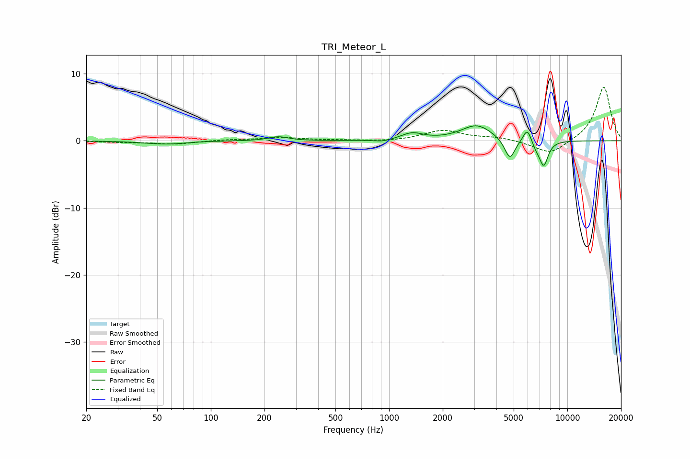

# TRI_Meteor_L
See [usage instructions](https://github.com/jaakkopasanen/AutoEq#usage) for more options and info.

### Parametric EQs
Apply preamp of -2.3 dB when using parametric equalizer.

|   # | Type    |   Fc (Hz) |    Q |   Gain (dB) |
|-----|---------|-----------|------|-------------|
|   1 | Peaking |        52 | 1.25 |        -0.4 |
|   2 | Peaking |        63 | 2.03 |        -0.1 |
|   3 | Peaking |       239 | 2.6  |         0.6 |
|   4 | Peaking |       921 | 2.91 |        -0.3 |
|   5 | Peaking |      1345 | 2.34 |         1   |
|   6 | Peaking |      3104 | 1.62 |         2.3 |
|   7 | Peaking |      4755 | 4.71 |        -3.1 |
|   8 | Peaking |      5957 | 5.99 |         2.1 |
|   9 | Peaking |      6669 | 6    |        -0.8 |
|  10 | Peaking |      7369 | 5.4  |        -3.7 |

### Fixed Band EQs
When using fixed band (also called graphic) equalizer, apply preamp of **-8.1 dB** (if available) and set gains manually with these parameters.

|   # | Type    |   Fc (Hz) |    Q |   Gain (dB) |
|-----|---------|-----------|------|-------------|
|   1 | Peaking |        31 | 1.41 |        -0.2 |
|   2 | Peaking |        62 | 1.41 |        -0.5 |
|   3 | Peaking |       125 | 1.41 |         0.2 |
|   4 | Peaking |       250 | 1.41 |         0.5 |
|   5 | Peaking |       500 | 1.41 |         0.1 |
|   6 | Peaking |      1000 | 1.41 |        -0.1 |
|   7 | Peaking |      2000 | 1.41 |         1.5 |
|   8 | Peaking |      4000 | 1.41 |         0.5 |
|   9 | Peaking |      8000 | 1.41 |        -2.1 |
|  10 | Peaking |     16000 | 1.41 |         8.1 |

### Graphs

