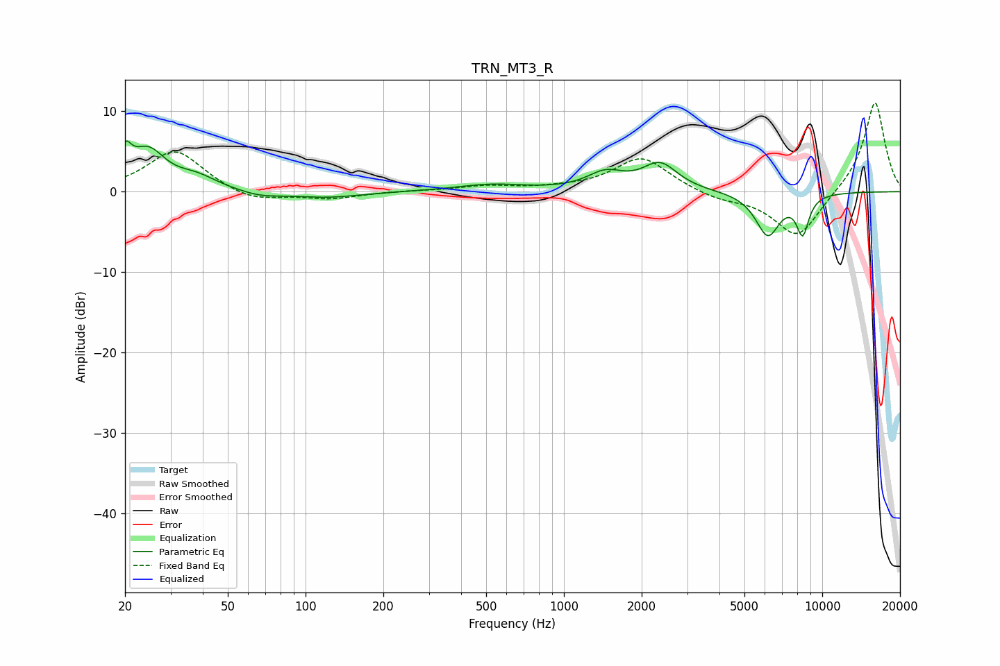

# TRN_MT3_R
See [usage instructions](https://github.com/jaakkopasanen/AutoEq#usage) for more options and info.

### Parametric EQs
Apply preamp of -6.4 dB when using parametric equalizer.

|   # | Type    |   Fc (Hz) |    Q |   Gain (dB) |
|-----|---------|-----------|------|-------------|
|   1 | Peaking |        20 | 5.77 |         3.4 |
|   2 | Peaking |        25 | 2.13 |         4.7 |
|   3 | Peaking |        38 | 1.74 |         1.5 |
|   4 | Peaking |        67 | 1.78 |        -0.6 |
|   5 | Peaking |       120 | 1.07 |        -0.7 |
|   6 | Peaking |       522 | 1.05 |         0.8 |
|   7 | Peaking |      1450 | 2    |         2.1 |
|   8 | Peaking |      2355 | 2.09 |         3.3 |
|   9 | Peaking |      6155 | 2.87 |        -5.4 |
|  10 | Peaking |      8398 | 5.42 |        -4.6 |

### Fixed Band EQs
When using fixed band (also called graphic) equalizer, apply preamp of **-11.1 dB** (if available) and set gains manually with these parameters.

|   # | Type    |   Fc (Hz) |    Q |   Gain (dB) |
|-----|---------|-----------|------|-------------|
|   1 | Peaking |        31 | 1.41 |         5.2 |
|   2 | Peaking |        62 | 1.41 |        -1.4 |
|   3 | Peaking |       125 | 1.41 |        -0.9 |
|   4 | Peaking |       250 | 1.41 |         0.1 |
|   5 | Peaking |       500 | 1.41 |         0.6 |
|   6 | Peaking |      1000 | 1.41 |         0.3 |
|   7 | Peaking |      2000 | 1.41 |         4.3 |
|   8 | Peaking |      4000 | 1.41 |        -0.9 |
|   9 | Peaking |      8000 | 1.41 |        -5.9 |
|  10 | Peaking |     16000 | 1.41 |        11.4 |

### Graphs

