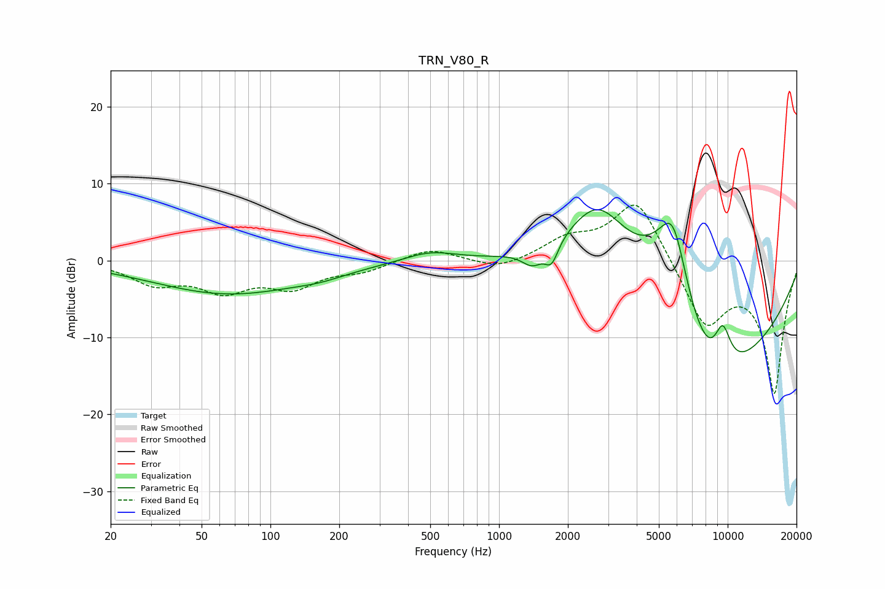

# TRN_V80_R
See [usage instructions](https://github.com/jaakkopasanen/AutoEq#usage) for more options and info.

### Parametric EQs
Apply preamp of -6.7 dB when using parametric equalizer.

|   # | Type    |   Fc (Hz) |    Q |   Gain (dB) |
|-----|---------|-----------|------|-------------|
|   1 | Peaking |        66 | 0.42 |        -4.3 |
|   2 | Peaking |       167 | 1.28 |        -0.6 |
|   3 | Peaking |       499 | 1.23 |         1.3 |
|   4 | Peaking |      1399 | 3.1  |        -2.1 |
|   5 | Peaking |      1697 | 4.85 |        -2.8 |
|   6 | Peaking |      2713 | 0.83 |        12.4 |
|   7 | Peaking |      5454 | 0.97 |         7.8 |
|   8 | Peaking |      5782 | 2.13 |         9.1 |
|   9 | Peaking |      8104 | 0.4  |       -20   |
|  10 | Peaking |      9511 | 3.45 |         5.3 |

### Fixed Band EQs
When using fixed band (also called graphic) equalizer, apply preamp of **-7.3 dB** (if available) and set gains manually with these parameters.

|   # | Type    |   Fc (Hz) |    Q |   Gain (dB) |
|-----|---------|-----------|------|-------------|
|   1 | Peaking |        31 | 1.41 |        -2.7 |
|   2 | Peaking |        62 | 1.41 |        -3.5 |
|   3 | Peaking |       125 | 1.41 |        -3.1 |
|   4 | Peaking |       250 | 1.41 |        -1.2 |
|   5 | Peaking |       500 | 1.41 |         1.6 |
|   6 | Peaking |      1000 | 1.41 |        -1.3 |
|   7 | Peaking |      2000 | 1.41 |         2.4 |
|   8 | Peaking |      4000 | 1.41 |         8.3 |
|   9 | Peaking |      8000 | 1.41 |        -8.3 |
|  10 | Peaking |     16000 | 1.41 |       -17.1 |

### Graphs

