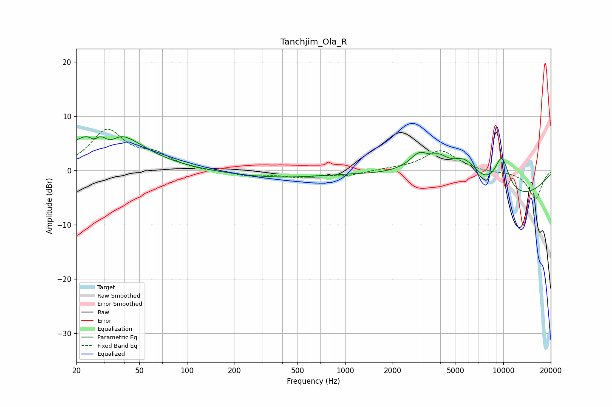

# Tanchjim_Ola_R
See [usage instructions](https://github.com/jaakkopasanen/AutoEq#usage) for more options and info.

### Parametric EQs
Apply preamp of -6.3 dB when using parametric equalizer.

|   # | Type    |   Fc (Hz) |    Q |   Gain (dB) |
|-----|---------|-----------|------|-------------|
|   1 | Peaking |        26 | 4.8  |        -1.6 |
|   2 | Peaking |        31 | 0.85 |        10.2 |
|   3 | Peaking |        32 | 2.54 |        -4   |
|   4 | Peaking |      1083 | 0.35 |         7.3 |
|   5 | Peaking |      2947 | 0.18 |       -17.8 |
|   6 | Peaking |      2948 | 2.46 |         2.5 |
|   7 | Peaking |      3391 | 0.4  |        13.4 |
|   8 | Peaking |      3948 | 2.91 |         1.6 |
|   9 | Peaking |      5740 | 1.5  |         4.8 |
|  10 | Peaking |      9791 | 2.55 |         6.8 |

### Fixed Band EQs
When using fixed band (also called graphic) equalizer, apply preamp of **-7.7 dB** (if available) and set gains manually with these parameters.

|   # | Type    |   Fc (Hz) |    Q |   Gain (dB) |
|-----|---------|-----------|------|-------------|
|   1 | Peaking |        31 | 1.41 |         7.2 |
|   2 | Peaking |        62 | 1.41 |         2.4 |
|   3 | Peaking |       125 | 1.41 |        -0.1 |
|   4 | Peaking |       250 | 1.41 |        -1   |
|   5 | Peaking |       500 | 1.41 |        -1   |
|   6 | Peaking |      1000 | 1.41 |        -0.9 |
|   7 | Peaking |      2000 | 1.41 |         0.2 |
|   8 | Peaking |      4000 | 1.41 |         3.7 |
|   9 | Peaking |      8000 | 1.41 |        -0.3 |
|  10 | Peaking |     16000 | 1.41 |        -5.2 |

### Graphs

