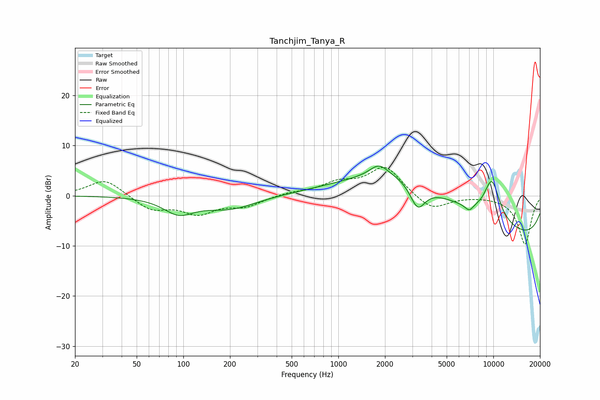

# Tanchjim_Tanya_R
See [usage instructions](https://github.com/jaakkopasanen/AutoEq#usage) for more options and info.

### Parametric EQs
Apply preamp of -6.0 dB when using parametric equalizer.

|   # | Type    |   Fc (Hz) |    Q |   Gain (dB) |
|-----|---------|-----------|------|-------------|
|   1 | Peaking |        93 | 1.46 |        -3.1 |
|   2 | Peaking |       200 | 0.84 |        -2.5 |
|   3 | Peaking |      1825 | 2.46 |         2.3 |
|   4 | Peaking |      2615 | 0.6  |         3.4 |
|   5 | Peaking |      3249 | 2.82 |        -5.1 |
|   6 | Peaking |      4144 | 0.24 |         7.4 |
|   7 | Peaking |      6991 | 4.76 |        -1.4 |
|   8 | Peaking |      8487 | 5.93 |        -0.1 |
|   9 | Peaking |      9777 | 2.31 |         8   |
|  10 | Peaking |      9850 | 0.18 |       -11   |

### Fixed Band EQs
When using fixed band (also called graphic) equalizer, apply preamp of **-5.8 dB** (if available) and set gains manually with these parameters.

|   # | Type    |   Fc (Hz) |    Q |   Gain (dB) |
|-----|---------|-----------|------|-------------|
|   1 | Peaking |        31 | 1.41 |         3.4 |
|   2 | Peaking |        62 | 1.41 |        -2.8 |
|   3 | Peaking |       125 | 1.41 |        -3.3 |
|   4 | Peaking |       250 | 1.41 |        -1.9 |
|   5 | Peaking |       500 | 1.41 |         0.6 |
|   6 | Peaking |      1000 | 1.41 |         2.2 |
|   7 | Peaking |      2000 | 1.41 |         5.8 |
|   8 | Peaking |      4000 | 1.41 |        -3   |
|   9 | Peaking |      8000 | 1.41 |         0   |
|  10 | Peaking |     16000 | 1.41 |        -9.7 |

### Graphs

