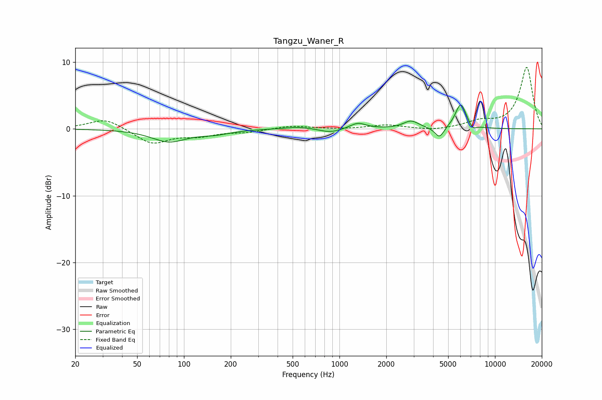

# Tangzu_Waner_R
See [usage instructions](https://github.com/jaakkopasanen/AutoEq#usage) for more options and info.

### Parametric EQs
Apply preamp of -3.7 dB when using parametric equalizer.

|   # | Type    |   Fc (Hz) |    Q |   Gain (dB) |
|-----|---------|-----------|------|-------------|
|   1 | Peaking |        80 | 1.27 |        -1.9 |
|   2 | Peaking |       158 | 1.39 |        -0.6 |
|   3 | Peaking |       530 | 1.28 |         0.1 |
|   4 | Peaking |       549 | 1.54 |         0.3 |
|   5 | Peaking |       872 | 1.99 |        -0.6 |
|   6 | Peaking |      1314 | 2.8  |         0.9 |
|   7 | Peaking |      2887 | 2.87 |         1.1 |
|   8 | Peaking |      4395 | 4.72 |        -1.7 |
|   9 | Peaking |      6027 | 3.86 |         3.8 |
|  10 | Peaking |      7175 | 6    |        -0.8 |

### Fixed Band EQs
When using fixed band (also called graphic) equalizer, apply preamp of **-9.3 dB** (if available) and set gains manually with these parameters.

|   # | Type    |   Fc (Hz) |    Q |   Gain (dB) |
|-----|---------|-----------|------|-------------|
|   1 | Peaking |        31 | 1.41 |         1.6 |
|   2 | Peaking |        62 | 1.41 |        -2.2 |
|   3 | Peaking |       125 | 1.41 |        -0.9 |
|   4 | Peaking |       250 | 1.41 |        -0.4 |
|   5 | Peaking |       500 | 1.41 |         0.5 |
|   6 | Peaking |      1000 | 1.41 |        -0.1 |
|   7 | Peaking |      2000 | 1.41 |         0.6 |
|   8 | Peaking |      4000 | 1.41 |        -0.3 |
|   9 | Peaking |      8000 | 1.41 |         1   |
|  10 | Peaking |     16000 | 1.41 |         9.2 |

### Graphs

