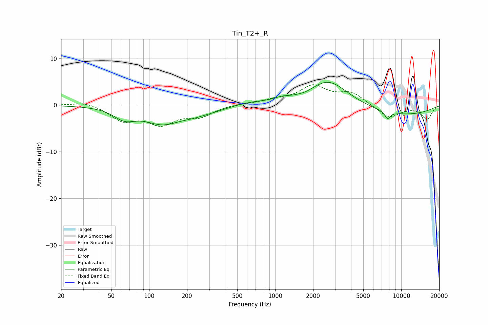

# Tin_T2+_R
See [usage instructions](https://github.com/jaakkopasanen/AutoEq#usage) for more options and info.

### Parametric EQs
Apply preamp of -5.0 dB when using parametric equalizer.

|   # | Type    |   Fc (Hz) |    Q |   Gain (dB) |
|-----|---------|-----------|------|-------------|
|   1 | Peaking |        64 | 1.67 |        -2.3 |
|   2 | Peaking |       128 | 0.98 |        -3.6 |
|   3 | Peaking |       224 | 1.33 |        -0.9 |
|   4 | Peaking |       322 | 1.1  |        -0.7 |
|   5 | Peaking |       643 | 1.06 |         0.6 |
|   6 | Peaking |      1129 | 2.34 |         0.6 |
|   7 | Peaking |      1763 | 2.99 |        -0.3 |
|   8 | Peaking |      2651 | 0.92 |         5.4 |
|   9 | Peaking |      7784 | 6    |        -1.6 |
|  10 | Peaking |     10000 | 0.4  |        -2.1 |

### Fixed Band EQs
When using fixed band (also called graphic) equalizer, apply preamp of **-4.5 dB** (if available) and set gains manually with these parameters.

|   # | Type    |   Fc (Hz) |    Q |   Gain (dB) |
|-----|---------|-----------|------|-------------|
|   1 | Peaking |        31 | 1.41 |         0.9 |
|   2 | Peaking |        62 | 1.41 |        -3.1 |
|   3 | Peaking |       125 | 1.41 |        -3.7 |
|   4 | Peaking |       250 | 1.41 |        -2.2 |
|   5 | Peaking |       500 | 1.41 |         0.3 |
|   6 | Peaking |      1000 | 1.41 |         0.9 |
|   7 | Peaking |      2000 | 1.41 |         3.9 |
|   8 | Peaking |      4000 | 1.41 |         2.5 |
|   9 | Peaking |      8000 | 1.41 |        -2.8 |
|  10 | Peaking |     16000 | 1.41 |        -3   |

### Graphs

