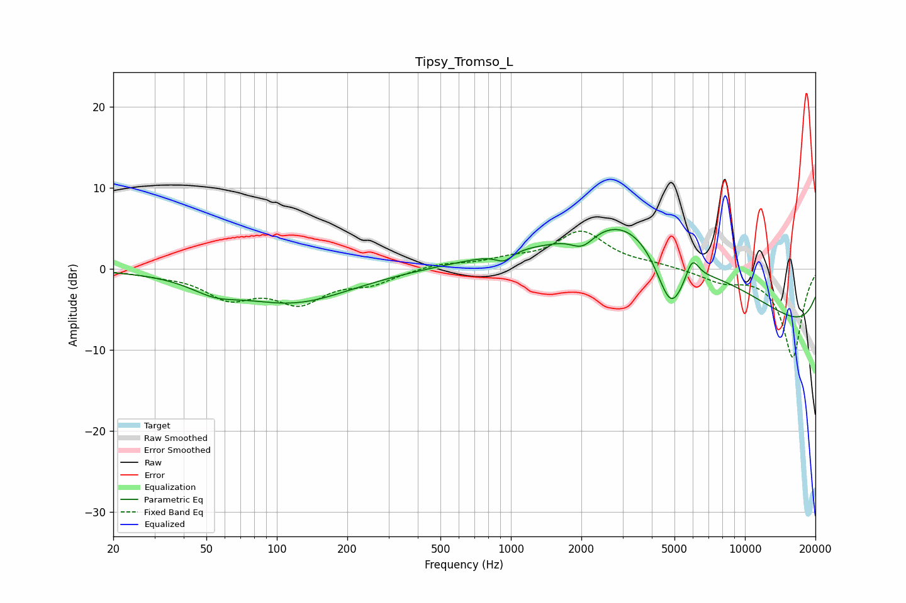

# Tipsy_Tromso_L
See [usage instructions](https://github.com/jaakkopasanen/AutoEq#usage) for more options and info.

### Parametric EQs
Apply preamp of -5.0 dB when using parametric equalizer.

|   # | Type    |   Fc (Hz) |    Q |   Gain (dB) |
|-----|---------|-----------|------|-------------|
|   1 | Peaking |        54 | 1.39 |        -1.5 |
|   2 | Peaking |       118 | 0.58 |        -4   |
|   3 | Peaking |       933 | 3.94 |        -1.1 |
|   4 | Peaking |      1443 | 1.89 |        -0.3 |
|   5 | Peaking |      2021 | 2.69 |        -2   |
|   6 | Peaking |      3203 | 0.71 |         4.8 |
|   7 | Peaking |      4823 | 2.13 |        -7.8 |
|   8 | Peaking |      4987 | 0.25 |        10   |
|   9 | Peaking |      5953 | 4.92 |         2.7 |
|  10 | Peaking |     10000 | 0.18 |       -11.1 |

### Fixed Band EQs
When using fixed band (also called graphic) equalizer, apply preamp of **-4.8 dB** (if available) and set gains manually with these parameters.

|   # | Type    |   Fc (Hz) |    Q |   Gain (dB) |
|-----|---------|-----------|------|-------------|
|   1 | Peaking |        31 | 1.41 |        -0.5 |
|   2 | Peaking |        62 | 1.41 |        -3.2 |
|   3 | Peaking |       125 | 1.41 |        -3.8 |
|   4 | Peaking |       250 | 1.41 |        -1.6 |
|   5 | Peaking |       500 | 1.41 |         0.7 |
|   6 | Peaking |      1000 | 1.41 |         0.9 |
|   7 | Peaking |      2000 | 1.41 |         4.5 |
|   8 | Peaking |      4000 | 1.41 |         0.4 |
|   9 | Peaking |      8000 | 1.41 |        -1.4 |
|  10 | Peaking |     16000 | 1.41 |       -10.9 |

### Graphs

