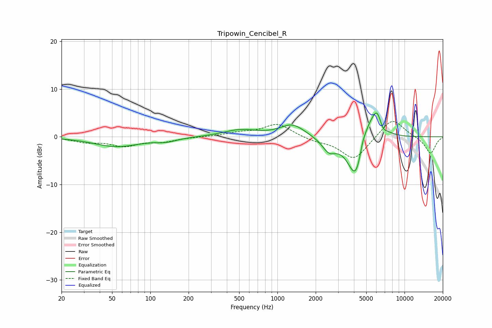

# Tripowin_Cencibel_R
See [usage instructions](https://github.com/jaakkopasanen/AutoEq#usage) for more options and info.

### Parametric EQs
Apply preamp of -5.1 dB when using parametric equalizer.

|   # | Type    |   Fc (Hz) |    Q |   Gain (dB) |
|-----|---------|-----------|------|-------------|
|   1 | Peaking |        54 | 0.78 |        -2   |
|   2 | Peaking |       134 | 1.7  |        -0.7 |
|   3 | Peaking |       509 | 1.09 |         1.4 |
|   4 | Peaking |      1313 | 1.46 |         2.6 |
|   5 | Peaking |      2546 | 2.59 |        -2.6 |
|   6 | Peaking |      4137 | 2.15 |        -9.1 |
|   7 | Peaking |      4672 | 6    |         1.9 |
|   8 | Peaking |      5152 | 3.45 |         2.6 |
|   9 | Peaking |      6087 | 2.64 |         7.1 |
|  10 | Peaking |      6701 | 4.32 |        -2.1 |

### Fixed Band EQs
When using fixed band (also called graphic) equalizer, apply preamp of **-3.3 dB** (if available) and set gains manually with these parameters.

|   # | Type    |   Fc (Hz) |    Q |   Gain (dB) |
|-----|---------|-----------|------|-------------|
|   1 | Peaking |        31 | 1.41 |        -1   |
|   2 | Peaking |        62 | 1.41 |        -1.8 |
|   3 | Peaking |       125 | 1.41 |        -0.9 |
|   4 | Peaking |       250 | 1.41 |        -0   |
|   5 | Peaking |       500 | 1.41 |         0.8 |
|   6 | Peaking |      1000 | 1.41 |         2.7 |
|   7 | Peaking |      2000 | 1.41 |        -0.8 |
|   8 | Peaking |      4000 | 1.41 |        -4.8 |
|   9 | Peaking |      8000 | 1.41 |         4.1 |
|  10 | Peaking |     16000 | 1.41 |        -3.6 |

### Graphs

