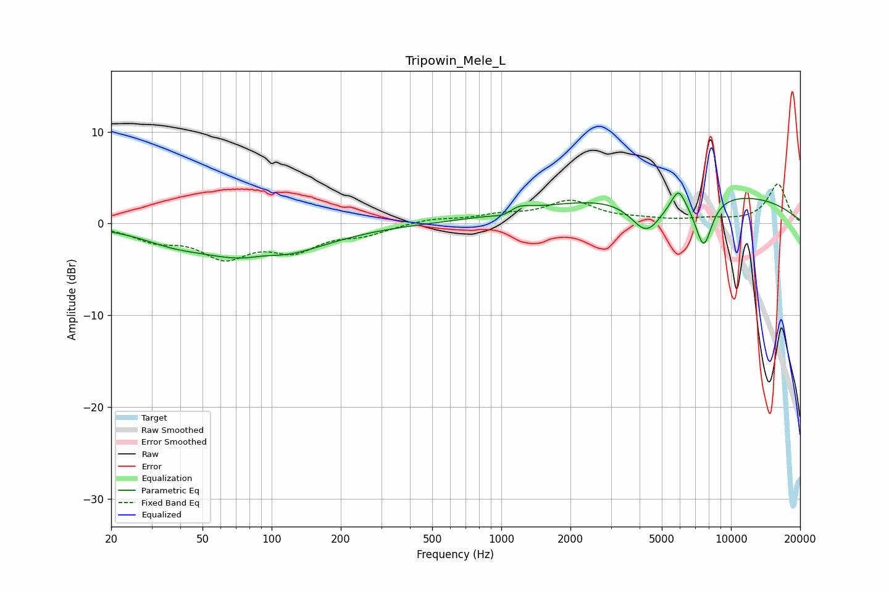

# Tripowin_Mele_L
See [usage instructions](https://github.com/jaakkopasanen/AutoEq#usage) for more options and info.

### Parametric EQs
Apply preamp of -3.4 dB when using parametric equalizer.

|   # | Type    |   Fc (Hz) |    Q |   Gain (dB) |
|-----|---------|-----------|------|-------------|
|   1 | Peaking |        36 | 2.05 |        -0   |
|   2 | Peaking |        37 | 1.03 |        -1   |
|   3 | Peaking |        89 | 0.6  |        -4.2 |
|   4 | Peaking |        92 | 1.67 |         0.8 |
|   5 | Peaking |      1047 | 2.98 |        -0.8 |
|   6 | Peaking |      1162 | 2.71 |         1   |
|   7 | Peaking |      4289 | 2.02 |        -3.9 |
|   8 | Peaking |      5902 | 4.66 |         2.1 |
|   9 | Peaking |      6387 | 0.2  |         3.5 |
|  10 | Peaking |      7601 | 3.52 |        -5.4 |

### Fixed Band EQs
When using fixed band (also called graphic) equalizer, apply preamp of **-4.4 dB** (if available) and set gains manually with these parameters.

|   # | Type    |   Fc (Hz) |    Q |   Gain (dB) |
|-----|---------|-----------|------|-------------|
|   1 | Peaking |        31 | 1.41 |        -1.6 |
|   2 | Peaking |        62 | 1.41 |        -3.3 |
|   3 | Peaking |       125 | 1.41 |        -2.6 |
|   4 | Peaking |       250 | 1.41 |        -1   |
|   5 | Peaking |       500 | 1.41 |         0.5 |
|   6 | Peaking |      1000 | 1.41 |         0.8 |
|   7 | Peaking |      2000 | 1.41 |         2.3 |
|   8 | Peaking |      4000 | 1.41 |         0.3 |
|   9 | Peaking |      8000 | 1.41 |         0.4 |
|  10 | Peaking |     16000 | 1.41 |         4.3 |

### Graphs

