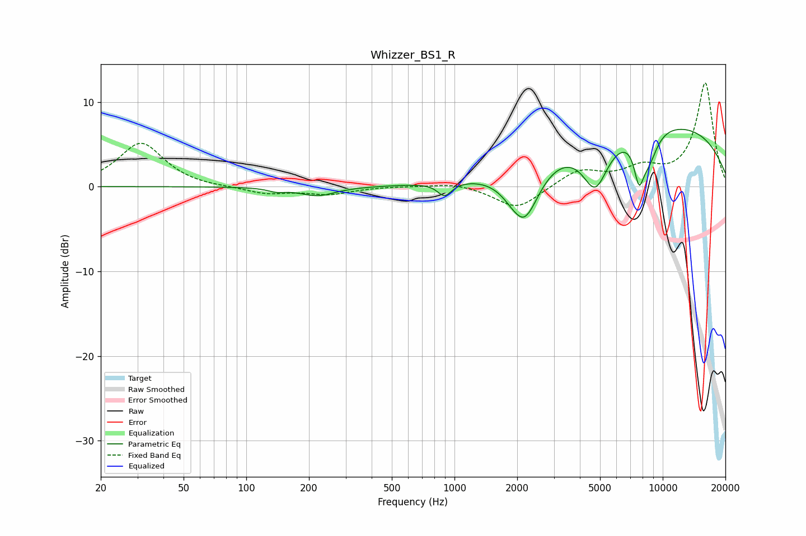

# Whizzer_BS1_R
See [usage instructions](https://github.com/jaakkopasanen/AutoEq#usage) for more options and info.

### Parametric EQs
Apply preamp of -6.9 dB when using parametric equalizer.

|   # | Type    |   Fc (Hz) |    Q |   Gain (dB) |
|-----|---------|-----------|------|-------------|
|   1 | Peaking |       140 | 3.5  |        -0.4 |
|   2 | Peaking |       220 | 1.66 |        -1.1 |
|   3 | Peaking |       896 | 4.22 |        -1.6 |
|   4 | Peaking |      2004 | 5.3  |         0.2 |
|   5 | Peaking |      2108 | 1.87 |        -4.8 |
|   6 | Peaking |      2192 | 2.08 |        -2.3 |
|   7 | Peaking |      4747 | 2.22 |        -5.9 |
|   8 | Peaking |      7692 | 5.52 |        -4.4 |
|   9 | Peaking |      8557 | 2.95 |        -3.4 |
|  10 | Peaking |      8937 | 0.22 |         7.7 |

### Fixed Band EQs
When using fixed band (also called graphic) equalizer, apply preamp of **-12.3 dB** (if available) and set gains manually with these parameters.

|   # | Type    |   Fc (Hz) |    Q |   Gain (dB) |
|-----|---------|-----------|------|-------------|
|   1 | Peaking |        31 | 1.41 |         5.2 |
|   2 | Peaking |        62 | 1.41 |        -0.1 |
|   3 | Peaking |       125 | 1.41 |        -0.8 |
|   4 | Peaking |       250 | 1.41 |        -0.9 |
|   5 | Peaking |       500 | 1.41 |         0.1 |
|   6 | Peaking |      1000 | 1.41 |         0.5 |
|   7 | Peaking |      2000 | 1.41 |        -2.7 |
|   8 | Peaking |      4000 | 1.41 |         1.9 |
|   9 | Peaking |      8000 | 1.41 |         1.9 |
|  10 | Peaking |     16000 | 1.41 |        12.2 |

### Graphs

