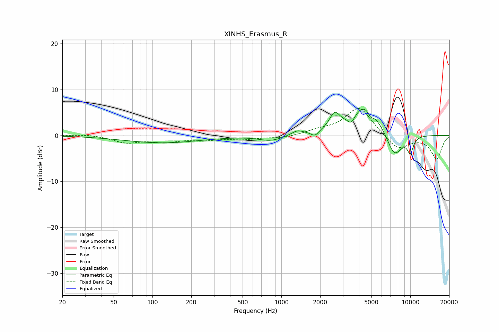

# XINHS_Erasmus_R
See [usage instructions](https://github.com/jaakkopasanen/AutoEq#usage) for more options and info.

### Parametric EQs
Apply preamp of -5.8 dB when using parametric equalizer.

|   # | Type    |   Fc (Hz) |    Q |   Gain (dB) |
|-----|---------|-----------|------|-------------|
|   1 | Peaking |       118 | 0.48 |        -1.6 |
|   2 | Peaking |       829 | 1.55 |        -1.2 |
|   3 | Peaking |      1333 | 3.19 |         1   |
|   4 | Peaking |      1822 | 4.73 |        -1.2 |
|   5 | Peaking |      2587 | 3.6  |         3.3 |
|   6 | Peaking |      3485 | 4.89 |        -1.9 |
|   7 | Peaking |      4514 | 1.22 |         7   |
|   8 | Peaking |      4930 | 6    |        -1.5 |
|   9 | Peaking |      7510 | 2.1  |        -5.7 |
|  10 | Peaking |     10000 | 5.23 |        -3.3 |

### Fixed Band EQs
When using fixed band (also called graphic) equalizer, apply preamp of **-6.0 dB** (if available) and set gains manually with these parameters.

|   # | Type    |   Fc (Hz) |    Q |   Gain (dB) |
|-----|---------|-----------|------|-------------|
|   1 | Peaking |        31 | 1.41 |         0.3 |
|   2 | Peaking |        62 | 1.41 |        -1.5 |
|   3 | Peaking |       125 | 1.41 |        -1.2 |
|   4 | Peaking |       250 | 1.41 |        -0.8 |
|   5 | Peaking |       500 | 1.41 |        -0.7 |
|   6 | Peaking |      1000 | 1.41 |        -0.6 |
|   7 | Peaking |      2000 | 1.41 |         0.9 |
|   8 | Peaking |      4000 | 1.41 |         6.3 |
|   9 | Peaking |      8000 | 1.41 |        -3.2 |
|  10 | Peaking |     16000 | 1.41 |        -5   |

### Graphs

