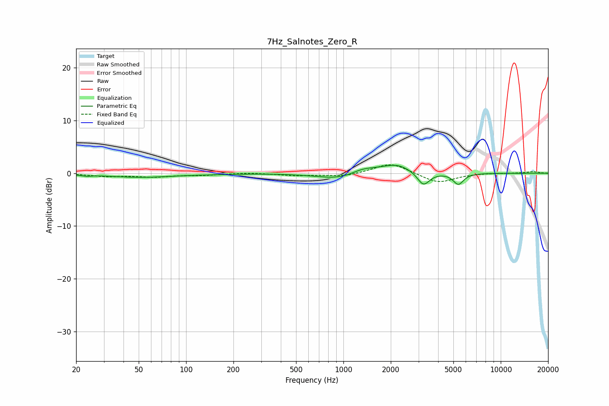

# 7Hz_Salnotes_Zero_R
See [usage instructions](https://github.com/jaakkopasanen/AutoEq#usage) for more options and info.

### Parametric EQs
Apply preamp of -1.6 dB when using parametric equalizer.

|   # | Type    |   Fc (Hz) |    Q |   Gain (dB) |
|-----|---------|-----------|------|-------------|
|   1 | Peaking |        23 | 4.14 |        -0.2 |
|   2 | Peaking |        52 | 0.65 |        -0.7 |
|   3 | Peaking |       147 | 1.35 |        -0.1 |
|   4 | Peaking |       787 | 0.93 |        -0.3 |
|   5 | Peaking |       978 | 1.18 |        -0.9 |
|   6 | Peaking |      1317 | 1.88 |         0.9 |
|   7 | Peaking |      2120 | 1.14 |         1.5 |
|   8 | Peaking |      2218 | 2.5  |         0.3 |
|   9 | Peaking |      3226 | 3.52 |        -2.7 |
|  10 | Peaking |      5378 | 4.2  |        -2.1 |

### Fixed Band EQs
When using fixed band (also called graphic) equalizer, apply preamp of **-1.7 dB** (if available) and set gains manually with these parameters.

|   # | Type    |   Fc (Hz) |    Q |   Gain (dB) |
|-----|---------|-----------|------|-------------|
|   1 | Peaking |        31 | 1.41 |        -0.5 |
|   2 | Peaking |        62 | 1.41 |        -0.6 |
|   3 | Peaking |       125 | 1.41 |        -0.3 |
|   4 | Peaking |       250 | 1.41 |         0.1 |
|   5 | Peaking |       500 | 1.41 |        -0.4 |
|   6 | Peaking |      1000 | 1.41 |        -0.6 |
|   7 | Peaking |      2000 | 1.41 |         2   |
|   8 | Peaking |      4000 | 1.41 |        -1.9 |
|   9 | Peaking |      8000 | 1.41 |         0.1 |
|  10 | Peaking |     16000 | 1.41 |         0.3 |

### Graphs

