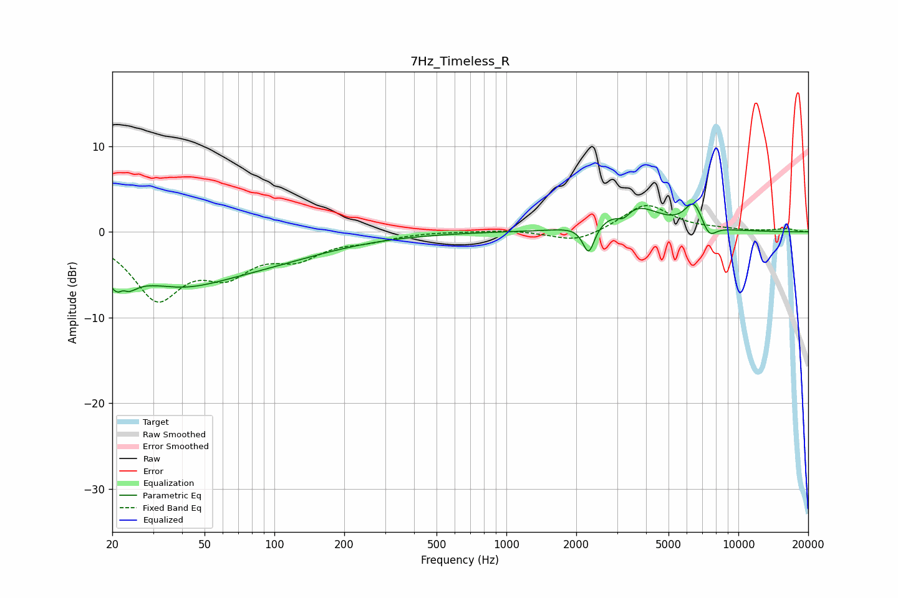

# 7Hz_Timeless_R
See [usage instructions](https://github.com/jaakkopasanen/AutoEq#usage) for more options and info.

### Parametric EQs
Apply preamp of -3.4 dB when using parametric equalizer.

|   # | Type    |   Fc (Hz) |    Q |   Gain (dB) |
|-----|---------|-----------|------|-------------|
|   1 | Peaking |        22 | 3.89 |        -5.2 |
|   2 | Peaking |        22 | 5.89 |         3.1 |
|   3 | Peaking |        41 | 0.96 |        -1.3 |
|   4 | Peaking |        42 | 0.29 |        -5   |
|   5 | Peaking |      2263 | 5.71 |        -3.8 |
|   6 | Peaking |      2266 | 5.92 |         0.4 |
|   7 | Peaking |      3204 | 4.56 |        -1.2 |
|   8 | Peaking |      3521 | 1.31 |         3.2 |
|   9 | Peaking |      6416 | 3.62 |         3   |
|  10 | Peaking |      7483 | 4.44 |        -1.6 |

### Fixed Band EQs
When using fixed band (also called graphic) equalizer, apply preamp of **-3.2 dB** (if available) and set gains manually with these parameters.

|   # | Type    |   Fc (Hz) |    Q |   Gain (dB) |
|-----|---------|-----------|------|-------------|
|   1 | Peaking |        31 | 1.41 |        -7.4 |
|   2 | Peaking |        62 | 1.41 |        -4   |
|   3 | Peaking |       125 | 1.41 |        -2.5 |
|   4 | Peaking |       250 | 1.41 |        -0.8 |
|   5 | Peaking |       500 | 1.41 |         0.1 |
|   6 | Peaking |      1000 | 1.41 |         0.2 |
|   7 | Peaking |      2000 | 1.41 |        -1.3 |
|   8 | Peaking |      4000 | 1.41 |         3.3 |
|   9 | Peaking |      8000 | 1.41 |         0.2 |
|  10 | Peaking |     16000 | 1.41 |         0.4 |

### Graphs

