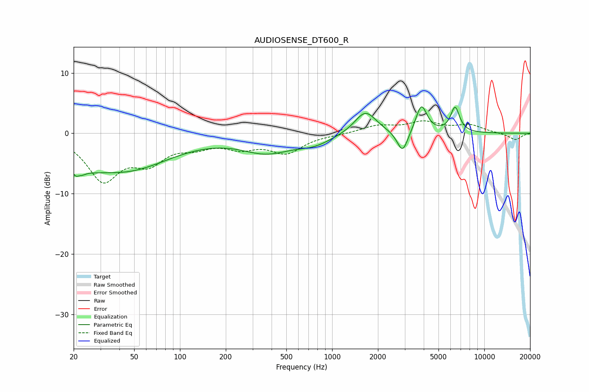

# AUDIOSENSE_DT600_R
See [usage instructions](https://github.com/jaakkopasanen/AutoEq#usage) for more options and info.

### Parametric EQs
Apply preamp of -4.5 dB when using parametric equalizer.

|   # | Type    |   Fc (Hz) |    Q |   Gain (dB) |
|-----|---------|-----------|------|-------------|
|   1 | Peaking |        21 | 4.35 |        -5.9 |
|   2 | Peaking |        21 | 5.74 |         3.3 |
|   3 | Peaking |        27 | 1.4  |        -1.1 |
|   4 | Peaking |        44 | 0.48 |        -5.9 |
|   5 | Peaking |       370 | 0.85 |        -2.8 |
|   6 | Peaking |       763 | 1.22 |        -1.4 |
|   7 | Peaking |      1655 | 1.98 |         3.8 |
|   8 | Peaking |      2903 | 3.93 |        -3.7 |
|   9 | Peaking |      3861 | 3.86 |         4.7 |
|  10 | Peaking |      6426 | 4.67 |         4.1 |

### Fixed Band EQs
When using fixed band (also called graphic) equalizer, apply preamp of **-2.2 dB** (if available) and set gains manually with these parameters.

|   # | Type    |   Fc (Hz) |    Q |   Gain (dB) |
|-----|---------|-----------|------|-------------|
|   1 | Peaking |        31 | 1.41 |        -7.4 |
|   2 | Peaking |        62 | 1.41 |        -4   |
|   3 | Peaking |       125 | 1.41 |        -1.7 |
|   4 | Peaking |       250 | 1.41 |        -2   |
|   5 | Peaking |       500 | 1.41 |        -3   |
|   6 | Peaking |      1000 | 1.41 |        -0.1 |
|   7 | Peaking |      2000 | 1.41 |         1.2 |
|   8 | Peaking |      4000 | 1.41 |         1.7 |
|   9 | Peaking |      8000 | 1.41 |         1.3 |
|  10 | Peaking |     16000 | 1.41 |        -1.1 |

### Graphs

