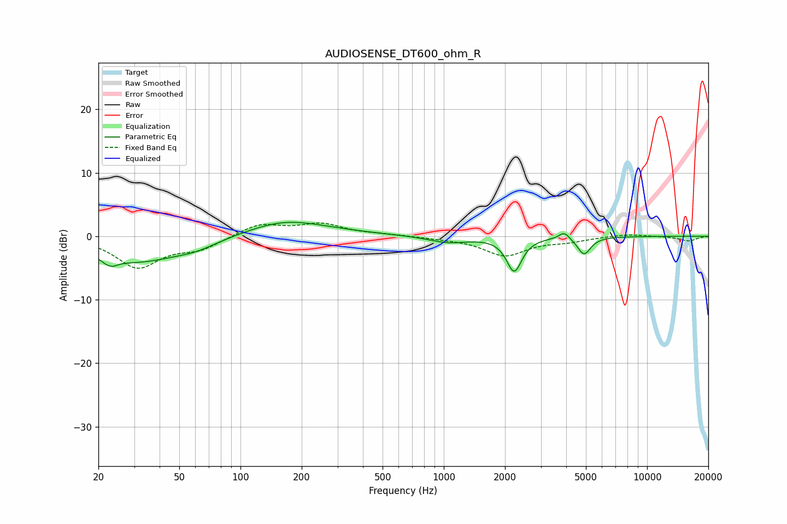

# AUDIOSENSE_DT600_ohm_R
See [usage instructions](https://github.com/jaakkopasanen/AutoEq#usage) for more options and info.

### Parametric EQs
Apply preamp of -2.3 dB when using parametric equalizer.

|   # | Type    |   Fc (Hz) |    Q |   Gain (dB) |
|-----|---------|-----------|------|-------------|
|   1 | Peaking |        23 | 6    |         3.2 |
|   2 | Peaking |        23 | 5.23 |        -4.4 |
|   3 | Peaking |        31 | 0.65 |        -3.9 |
|   4 | Peaking |        60 | 1.34 |        -1   |
|   5 | Peaking |       162 | 0.76 |         2.2 |
|   6 | Peaking |       260 | 0.6  |         0.4 |
|   7 | Peaking |      1049 | 1.44 |        -1   |
|   8 | Peaking |      2220 | 3.81 |        -5.4 |
|   9 | Peaking |      3915 | 5.49 |         1.2 |
|  10 | Peaking |      4901 | 4.36 |        -2.8 |

### Fixed Band EQs
When using fixed band (also called graphic) equalizer, apply preamp of **-2.2 dB** (if available) and set gains manually with these parameters.

|   # | Type    |   Fc (Hz) |    Q |   Gain (dB) |
|-----|---------|-----------|------|-------------|
|   1 | Peaking |        31 | 1.41 |        -4.8 |
|   2 | Peaking |        62 | 1.41 |        -1.8 |
|   3 | Peaking |       125 | 1.41 |         2   |
|   4 | Peaking |       250 | 1.41 |         1.8 |
|   5 | Peaking |       500 | 1.41 |         0.2 |
|   6 | Peaking |      1000 | 1.41 |        -0.2 |
|   7 | Peaking |      2000 | 1.41 |        -3   |
|   8 | Peaking |      4000 | 1.41 |        -0.7 |
|   9 | Peaking |      8000 | 1.41 |         0.4 |
|  10 | Peaking |     16000 | 1.41 |        -0.7 |

### Graphs

