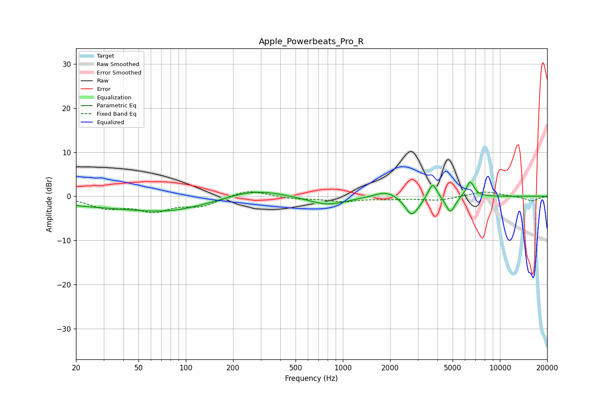

# Apple_Powerbeats_Pro_R
See [usage instructions](https://github.com/jaakkopasanen/AutoEq#usage) for more options and info.

### Parametric EQs
Apply preamp of -3.3 dB when using parametric equalizer.

|   # | Type    |   Fc (Hz) |    Q |   Gain (dB) |
|-----|---------|-----------|------|-------------|
|   1 | Peaking |        52 | 0.23 |        -2.5 |
|   2 | Peaking |        76 | 0.73 |        -1.2 |
|   3 | Peaking |       266 | 0.76 |         2.3 |
|   4 | Peaking |       794 | 1.15 |        -2   |
|   5 | Peaking |      1877 | 2.11 |         1.5 |
|   6 | Peaking |      2723 | 3.54 |        -3.8 |
|   7 | Peaking |      3000 | 3.26 |        -0.9 |
|   8 | Peaking |      3727 | 5.12 |         3.7 |
|   9 | Peaking |      4840 | 4.71 |        -3.8 |
|  10 | Peaking |      6467 | 5.35 |         3.5 |

### Fixed Band EQs
When using fixed band (also called graphic) equalizer, apply preamp of **-1.1 dB** (if available) and set gains manually with these parameters.

|   # | Type    |   Fc (Hz) |    Q |   Gain (dB) |
|-----|---------|-----------|------|-------------|
|   1 | Peaking |        31 | 1.41 |        -2.4 |
|   2 | Peaking |        62 | 1.41 |        -3   |
|   3 | Peaking |       125 | 1.41 |        -2   |
|   4 | Peaking |       250 | 1.41 |         1.6 |
|   5 | Peaking |       500 | 1.41 |        -0.5 |
|   6 | Peaking |      1000 | 1.41 |        -1.1 |
|   7 | Peaking |      2000 | 1.41 |        -0.5 |
|   8 | Peaking |      4000 | 1.41 |        -0.9 |
|   9 | Peaking |      8000 | 1.41 |         1.2 |
|  10 | Peaking |     16000 | 1.41 |        -1.1 |

### Graphs

