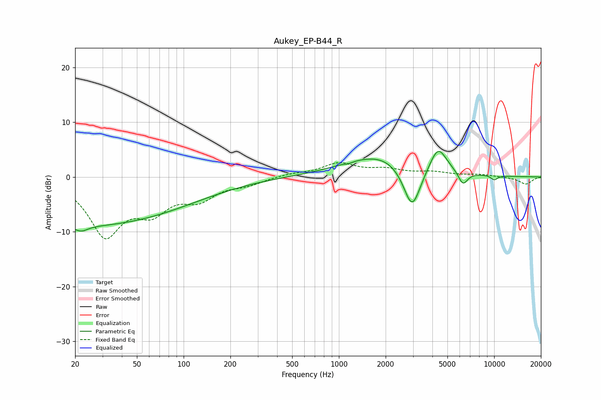

# Aukey_EP-B44_R
See [usage instructions](https://github.com/jaakkopasanen/AutoEq#usage) for more options and info.

### Parametric EQs
Apply preamp of -4.7 dB when using parametric equalizer.

|   # | Type    |   Fc (Hz) |    Q |   Gain (dB) |
|-----|---------|-----------|------|-------------|
|   1 | Peaking |        22 | 3.33 |        -1.1 |
|   2 | Peaking |        23 | 0.19 |        -8.8 |
|   3 | Peaking |      1069 | 5.68 |         0.1 |
|   4 | Peaking |      1130 | 5.58 |        -0.3 |
|   5 | Peaking |      1993 | 0.58 |         4.4 |
|   6 | Peaking |      2960 | 2.36 |        -8.9 |
|   7 | Peaking |      4354 | 2.57 |         4.7 |
|   8 | Peaking |      6296 | 4.48 |        -2.5 |
|   9 | Peaking |      9979 | 4.04 |         0.7 |
|  10 | Peaking |     10000 | 4.78 |        -1.5 |

### Fixed Band EQs
When using fixed band (also called graphic) equalizer, apply preamp of **-2.7 dB** (if available) and set gains manually with these parameters.

|   # | Type    |   Fc (Hz) |    Q |   Gain (dB) |
|-----|---------|-----------|------|-------------|
|   1 | Peaking |        31 | 1.41 |       -10.2 |
|   2 | Peaking |        62 | 1.41 |        -5.1 |
|   3 | Peaking |       125 | 1.41 |        -3.4 |
|   4 | Peaking |       250 | 1.41 |        -1.1 |
|   5 | Peaking |       500 | 1.41 |         0.5 |
|   6 | Peaking |      1000 | 1.41 |         2.4 |
|   7 | Peaking |      2000 | 1.41 |         1.2 |
|   8 | Peaking |      4000 | 1.41 |         0.8 |
|   9 | Peaking |      8000 | 1.41 |         0.4 |
|  10 | Peaking |     16000 | 1.41 |        -1.3 |

### Graphs

