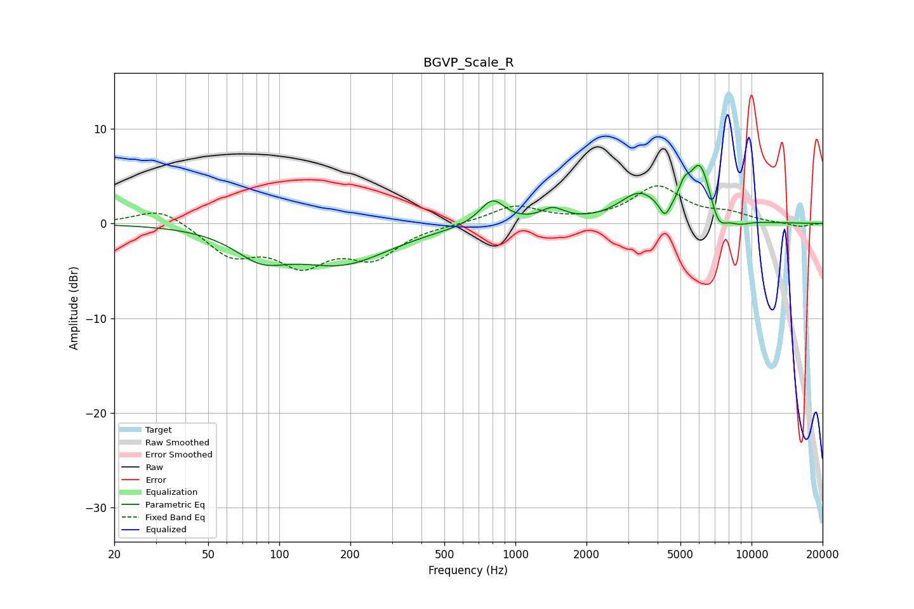

# BGVP_Scale_R
See [usage instructions](https://github.com/jaakkopasanen/AutoEq#usage) for more options and info.

### Parametric EQs
Apply preamp of -6.2 dB when using parametric equalizer.

|   # | Type    |   Fc (Hz) |    Q |   Gain (dB) |
|-----|---------|-----------|------|-------------|
|   1 | Peaking |        84 | 1.27 |        -2.7 |
|   2 | Peaking |       184 | 0.69 |        -4   |
|   3 | Peaking |       798 | 2.63 |         2.7 |
|   4 | Peaking |      1436 | 2.78 |         1.3 |
|   5 | Peaking |      3341 | 1.69 |         2.9 |
|   6 | Peaking |      4299 | 6    |        -1.8 |
|   7 | Peaking |      5182 | 5.96 |         1.6 |
|   8 | Peaking |      6055 | 2.88 |         6   |
|   9 | Peaking |      7238 | 3.93 |        -2.1 |
|  10 | Peaking |      8844 | 2.79 |        -0.5 |

### Fixed Band EQs
When using fixed band (also called graphic) equalizer, apply preamp of **-4.1 dB** (if available) and set gains manually with these parameters.

|   # | Type    |   Fc (Hz) |    Q |   Gain (dB) |
|-----|---------|-----------|------|-------------|
|   1 | Peaking |        31 | 1.41 |         1.8 |
|   2 | Peaking |        62 | 1.41 |        -3.2 |
|   3 | Peaking |       125 | 1.41 |        -3.8 |
|   4 | Peaking |       250 | 1.41 |        -3.3 |
|   5 | Peaking |       500 | 1.41 |        -0.1 |
|   6 | Peaking |      1000 | 1.41 |         1.8 |
|   7 | Peaking |      2000 | 1.41 |         0.1 |
|   8 | Peaking |      4000 | 1.41 |         3.8 |
|   9 | Peaking |      8000 | 1.41 |         0.9 |
|  10 | Peaking |     16000 | 1.41 |        -0.4 |

### Graphs

