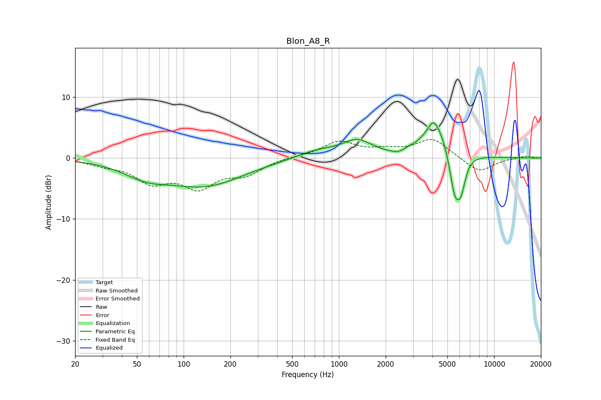

# Blon_A8_R
See [usage instructions](https://github.com/jaakkopasanen/AutoEq#usage) for more options and info.

### Parametric EQs
Apply preamp of -5.9 dB when using parametric equalizer.

|   # | Type    |   Fc (Hz) |    Q |   Gain (dB) |
|-----|---------|-----------|------|-------------|
|   1 | Peaking |        57 | 0.97 |        -2.1 |
|   2 | Peaking |       138 | 0.57 |        -4.3 |
|   3 | Peaking |       717 | 1.07 |         1.2 |
|   4 | Peaking |      1312 | 1.45 |         2.6 |
|   5 | Peaking |      2618 | 2.03 |        -1.2 |
|   6 | Peaking |      2775 | 3.68 |         0.8 |
|   7 | Peaking |      4058 | 5.39 |         1.2 |
|   8 | Peaking |      4252 | 1.55 |         6   |
|   9 | Peaking |      5580 | 3.74 |        -7.6 |
|  10 | Peaking |      6131 | 5.02 |        -4.1 |

### Fixed Band EQs
When using fixed band (also called graphic) equalizer, apply preamp of **-3.1 dB** (if available) and set gains manually with these parameters.

|   # | Type    |   Fc (Hz) |    Q |   Gain (dB) |
|-----|---------|-----------|------|-------------|
|   1 | Peaking |        31 | 1.41 |        -0.9 |
|   2 | Peaking |        62 | 1.41 |        -3.6 |
|   3 | Peaking |       125 | 1.41 |        -4.3 |
|   4 | Peaking |       250 | 1.41 |        -2.3 |
|   5 | Peaking |       500 | 1.41 |         0.2 |
|   6 | Peaking |      1000 | 1.41 |         2.6 |
|   7 | Peaking |      2000 | 1.41 |         1   |
|   8 | Peaking |      4000 | 1.41 |         3.1 |
|   9 | Peaking |      8000 | 1.41 |        -2.4 |
|  10 | Peaking |     16000 | 1.41 |         0.4 |

### Graphs

