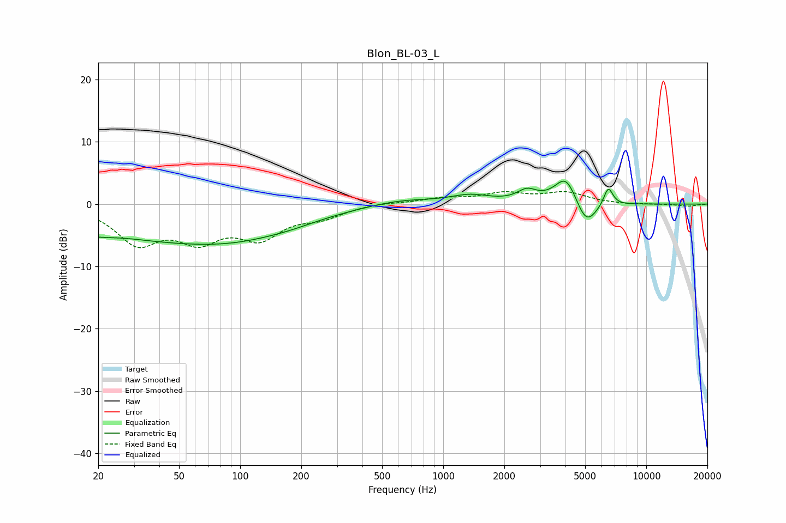

# Blon_BL-03_L
See [usage instructions](https://github.com/jaakkopasanen/AutoEq#usage) for more options and info.

### Parametric EQs
Apply preamp of -3.8 dB when using parametric equalizer.

|   # | Type    |   Fc (Hz) |    Q |   Gain (dB) |
|-----|---------|-----------|------|-------------|
|   1 | Peaking |        25 | 0.19 |        -5.1 |
|   2 | Peaking |        27 | 1.57 |         0.3 |
|   3 | Peaking |       107 | 0.47 |        -2.7 |
|   4 | Peaking |       180 | 1.22 |        -0.3 |
|   5 | Peaking |       618 | 0.88 |         0.9 |
|   6 | Peaking |      1361 | 1.44 |         1.3 |
|   7 | Peaking |      2588 | 2.91 |         1.8 |
|   8 | Peaking |      4032 | 2.5  |         4.8 |
|   9 | Peaking |      5051 | 2.62 |        -4.3 |
|  10 | Peaking |      6501 | 5.98 |         3.1 |

### Fixed Band EQs
When using fixed band (also called graphic) equalizer, apply preamp of **-2.1 dB** (if available) and set gains manually with these parameters.

|   # | Type    |   Fc (Hz) |    Q |   Gain (dB) |
|-----|---------|-----------|------|-------------|
|   1 | Peaking |        31 | 1.41 |        -5.9 |
|   2 | Peaking |        62 | 1.41 |        -4.9 |
|   3 | Peaking |       125 | 1.41 |        -4.8 |
|   4 | Peaking |       250 | 1.41 |        -1.8 |
|   5 | Peaking |       500 | 1.41 |         0.3 |
|   6 | Peaking |      1000 | 1.41 |         0.8 |
|   7 | Peaking |      2000 | 1.41 |         1.6 |
|   8 | Peaking |      4000 | 1.41 |         1.7 |
|   9 | Peaking |      8000 | 1.41 |        -0.1 |
|  10 | Peaking |     16000 | 1.41 |        -0.3 |

### Graphs

