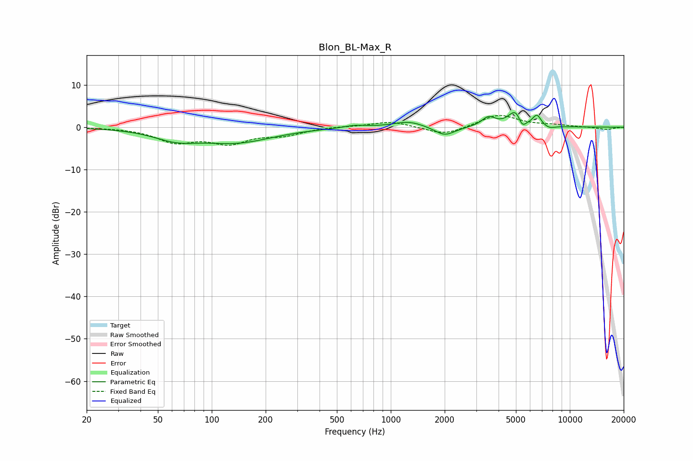

# Blon_BL-Max_R
See [usage instructions](https://github.com/jaakkopasanen/AutoEq#usage) for more options and info.

### Parametric EQs
Apply preamp of -3.5 dB when using parametric equalizer.

|   # | Type    |   Fc (Hz) |    Q |   Gain (dB) |
|-----|---------|-----------|------|-------------|
|   1 | Peaking |        63 | 1.12 |        -2.4 |
|   2 | Peaking |       139 | 0.71 |        -3.3 |
|   3 | Peaking |       633 | 2.23 |         0.6 |
|   4 | Peaking |      1259 | 1.69 |         1.4 |
|   5 | Peaking |      2002 | 2.48 |        -2.2 |
|   6 | Peaking |      3516 | 3.76 |         2.2 |
|   7 | Peaking |      5012 | 3.43 |         4.3 |
|   8 | Peaking |      5407 | 5.95 |        -2.8 |
|   9 | Peaking |      6551 | 5.92 |         2.5 |
|  10 | Peaking |      7664 | 4.4  |        -0.7 |

### Fixed Band EQs
When using fixed band (also called graphic) equalizer, apply preamp of **-2.9 dB** (if available) and set gains manually with these parameters.

|   # | Type    |   Fc (Hz) |    Q |   Gain (dB) |
|-----|---------|-----------|------|-------------|
|   1 | Peaking |        31 | 1.41 |        -0   |
|   2 | Peaking |        62 | 1.41 |        -3.2 |
|   3 | Peaking |       125 | 1.41 |        -3.4 |
|   4 | Peaking |       250 | 1.41 |        -1.6 |
|   5 | Peaking |       500 | 1.41 |         0.2 |
|   6 | Peaking |      1000 | 1.41 |         1.4 |
|   7 | Peaking |      2000 | 1.41 |        -2   |
|   8 | Peaking |      4000 | 1.41 |         3   |
|   9 | Peaking |      8000 | 1.41 |         0.4 |
|  10 | Peaking |     16000 | 1.41 |        -0.6 |

### Graphs

