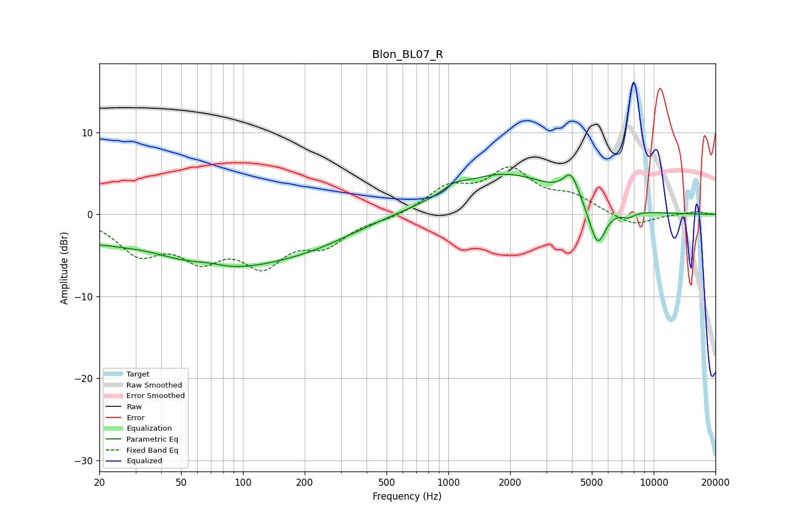

# Blon_BL07_R
See [usage instructions](https://github.com/jaakkopasanen/AutoEq#usage) for more options and info.

### Parametric EQs
Apply preamp of -5.0 dB when using parametric equalizer.

|   # | Type    |   Fc (Hz) |    Q |   Gain (dB) |
|-----|---------|-----------|------|-------------|
|   1 | Peaking |        20 | 5.79 |        -0.5 |
|   2 | Peaking |        23 | 1.29 |        -1.3 |
|   3 | Peaking |        68 | 1.83 |         0.6 |
|   4 | Peaking |        76 | 0.42 |        -6.1 |
|   5 | Peaking |       227 | 0.62 |        -1.8 |
|   6 | Peaking |      1070 | 2.81 |         0.8 |
|   7 | Peaking |      1854 | 0.55 |         4.9 |
|   8 | Peaking |      3965 | 3.66 |         3.1 |
|   9 | Peaking |      5321 | 3.39 |        -5.2 |
|  10 | Peaking |      7516 | 4.12 |        -0.7 |

### Fixed Band EQs
When using fixed band (also called graphic) equalizer, apply preamp of **-5.9 dB** (if available) and set gains manually with these parameters.

|   # | Type    |   Fc (Hz) |    Q |   Gain (dB) |
|-----|---------|-----------|------|-------------|
|   1 | Peaking |        31 | 1.41 |        -4.3 |
|   2 | Peaking |        62 | 1.41 |        -4.5 |
|   3 | Peaking |       125 | 1.41 |        -5.3 |
|   4 | Peaking |       250 | 1.41 |        -3.2 |
|   5 | Peaking |       500 | 1.41 |        -0.5 |
|   6 | Peaking |      1000 | 1.41 |         3   |
|   7 | Peaking |      2000 | 1.41 |         5   |
|   8 | Peaking |      4000 | 1.41 |         1.9 |
|   9 | Peaking |      8000 | 1.41 |        -1.5 |
|  10 | Peaking |     16000 | 1.41 |         0.4 |

### Graphs

