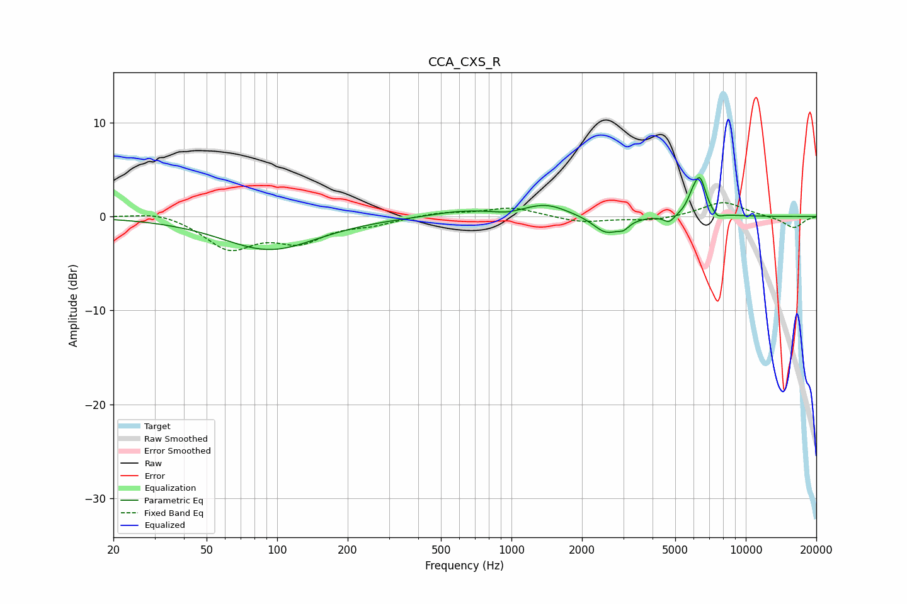

# CCA_CXS_R
See [usage instructions](https://github.com/jaakkopasanen/AutoEq#usage) for more options and info.

### Parametric EQs
Apply preamp of -4.2 dB when using parametric equalizer.

|   # | Type    |   Fc (Hz) |    Q |   Gain (dB) |
|-----|---------|-----------|------|-------------|
|   1 | Peaking |        93 | 0.7  |        -3.5 |
|   2 | Peaking |       622 | 1.07 |         0.6 |
|   3 | Peaking |       965 | 2.92 |        -0.2 |
|   4 | Peaking |      1402 | 1.51 |         1.3 |
|   5 | Peaking |      2541 | 2.49 |        -1.9 |
|   6 | Peaking |      3009 | 6    |        -0.7 |
|   7 | Peaking |      4711 | 6    |        -0.8 |
|   8 | Peaking |      5920 | 5.98 |         1.1 |
|   9 | Peaking |      6373 | 5.11 |         3.8 |
|  10 | Peaking |      7576 | 6    |        -0.6 |

### Fixed Band EQs
When using fixed band (also called graphic) equalizer, apply preamp of **-1.6 dB** (if available) and set gains manually with these parameters.

|   # | Type    |   Fc (Hz) |    Q |   Gain (dB) |
|-----|---------|-----------|------|-------------|
|   1 | Peaking |        31 | 1.41 |         0.6 |
|   2 | Peaking |        62 | 1.41 |        -3.3 |
|   3 | Peaking |       125 | 1.41 |        -2.4 |
|   4 | Peaking |       250 | 1.41 |        -0.7 |
|   5 | Peaking |       500 | 1.41 |         0.4 |
|   6 | Peaking |      1000 | 1.41 |         1   |
|   7 | Peaking |      2000 | 1.41 |        -0.6 |
|   8 | Peaking |      4000 | 1.41 |        -0.4 |
|   9 | Peaking |      8000 | 1.41 |         1.6 |
|  10 | Peaking |     16000 | 1.41 |        -1.2 |

### Graphs

