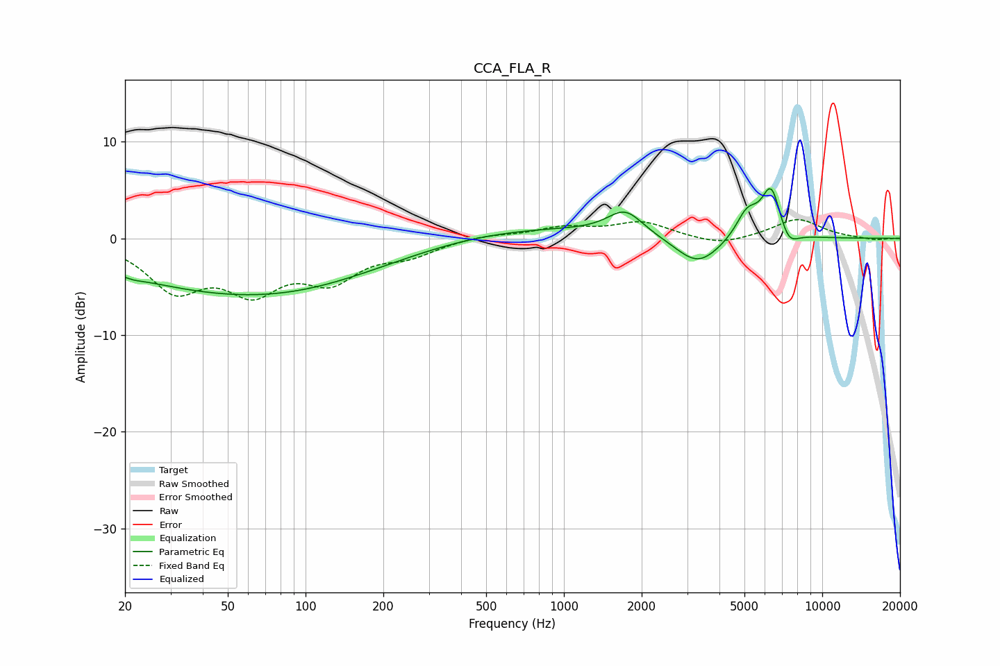

# CCA_FLA_R
See [usage instructions](https://github.com/jaakkopasanen/AutoEq#usage) for more options and info.

### Parametric EQs
Apply preamp of -5.2 dB when using parametric equalizer.

|   # | Type    |   Fc (Hz) |    Q |   Gain (dB) |
|-----|---------|-----------|------|-------------|
|   1 | Peaking |        22 | 4.47 |        -0.2 |
|   2 | Peaking |        41 | 1.31 |        -0   |
|   3 | Peaking |        45 | 0.3  |        -4.6 |
|   4 | Peaking |       122 | 0.36 |        -1.9 |
|   5 | Peaking |       648 | 0.36 |         1.2 |
|   6 | Peaking |      1727 | 2.08 |         2.5 |
|   7 | Peaking |      3301 | 1.6  |        -3   |
|   8 | Peaking |      5118 | 3.22 |         2.7 |
|   9 | Peaking |      6347 | 3.6  |         5.3 |
|  10 | Peaking |      7391 | 3.66 |        -1.7 |

### Fixed Band EQs
When using fixed band (also called graphic) equalizer, apply preamp of **-2.0 dB** (if available) and set gains manually with these parameters.

|   # | Type    |   Fc (Hz) |    Q |   Gain (dB) |
|-----|---------|-----------|------|-------------|
|   1 | Peaking |        31 | 1.41 |        -4.9 |
|   2 | Peaking |        62 | 1.41 |        -4.7 |
|   3 | Peaking |       125 | 1.41 |        -3.8 |
|   4 | Peaking |       250 | 1.41 |        -1.5 |
|   5 | Peaking |       500 | 1.41 |         0.4 |
|   6 | Peaking |      1000 | 1.41 |         1   |
|   7 | Peaking |      2000 | 1.41 |         1.6 |
|   8 | Peaking |      4000 | 1.41 |        -0.8 |
|   9 | Peaking |      8000 | 1.41 |         2   |
|  10 | Peaking |     16000 | 1.41 |        -0.2 |

### Graphs

