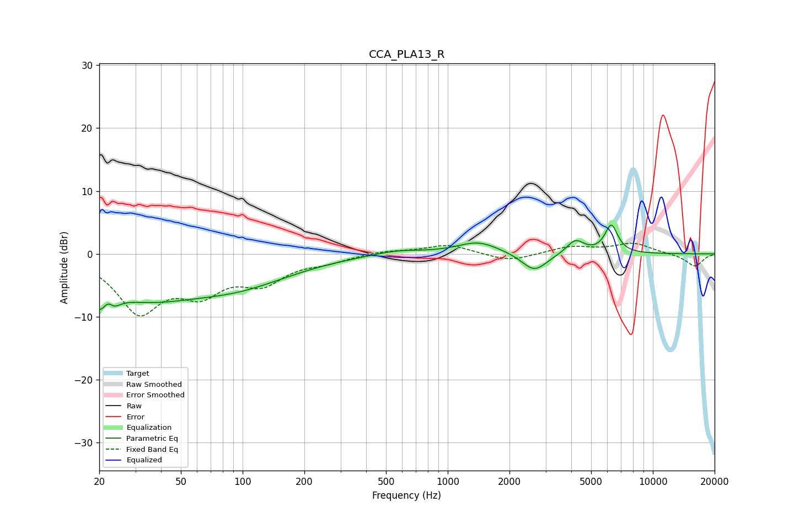

# CCA_PLA13_R
See [usage instructions](https://github.com/jaakkopasanen/AutoEq#usage) for more options and info.

### Parametric EQs
Apply preamp of -4.7 dB when using parametric equalizer.

|   # | Type    |   Fc (Hz) |    Q |   Gain (dB) |
|-----|---------|-----------|------|-------------|
|   1 | Peaking |        20 | 4.6  |        -3.3 |
|   2 | Peaking |        23 | 4.63 |         4   |
|   3 | Peaking |        23 | 4.25 |        -4.5 |
|   4 | Peaking |        32 | 0.52 |        -6.1 |
|   5 | Peaking |        97 | 0.54 |        -4   |
|   6 | Peaking |       565 | 1.17 |         0.7 |
|   7 | Peaking |      1408 | 1.39 |         1.9 |
|   8 | Peaking |      2648 | 2.27 |        -3   |
|   9 | Peaking |      4190 | 3.3  |         2.2 |
|  10 | Peaking |      6273 | 4.36 |         4.5 |

### Fixed Band EQs
When using fixed band (also called graphic) equalizer, apply preamp of **-1.8 dB** (if available) and set gains manually with these parameters.

|   # | Type    |   Fc (Hz) |    Q |   Gain (dB) |
|-----|---------|-----------|------|-------------|
|   1 | Peaking |        31 | 1.41 |        -8.7 |
|   2 | Peaking |        62 | 1.41 |        -5.1 |
|   3 | Peaking |       125 | 1.41 |        -4   |
|   4 | Peaking |       250 | 1.41 |        -1   |
|   5 | Peaking |       500 | 1.41 |         0.5 |
|   6 | Peaking |      1000 | 1.41 |         1.5 |
|   7 | Peaking |      2000 | 1.41 |        -1.3 |
|   8 | Peaking |      4000 | 1.41 |         1.1 |
|   9 | Peaking |      8000 | 1.41 |         1.6 |
|  10 | Peaking |     16000 | 1.41 |        -2   |

### Graphs

