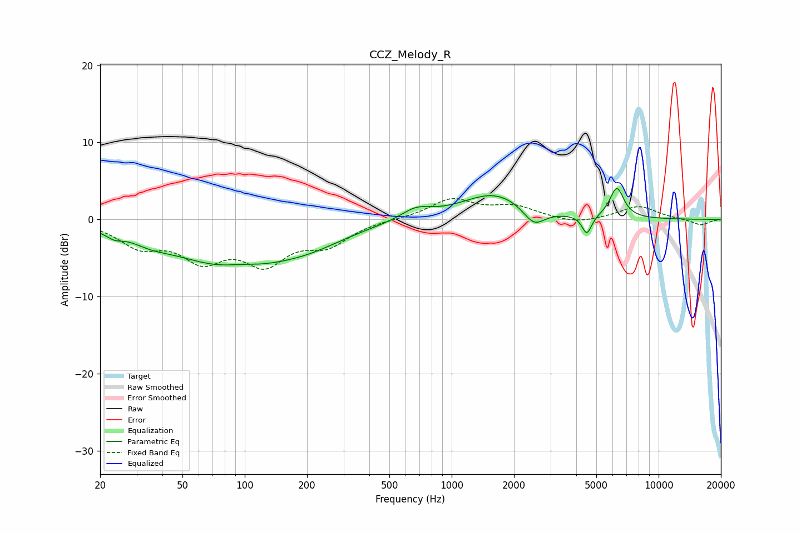

# CCZ_Melody_R
See [usage instructions](https://github.com/jaakkopasanen/AutoEq#usage) for more options and info.

### Parametric EQs
Apply preamp of -4.1 dB when using parametric equalizer.

|   # | Type    |   Fc (Hz) |    Q |   Gain (dB) |
|-----|---------|-----------|------|-------------|
|   1 | Peaking |        23 | 3.86 |        -0.7 |
|   2 | Peaking |        35 | 1.81 |        -0.7 |
|   3 | Peaking |        86 | 0.45 |        -5.9 |
|   4 | Peaking |        96 | 1.74 |         0.5 |
|   5 | Peaking |       208 | 0.82 |        -1.3 |
|   6 | Peaking |       673 | 1.93 |         1.4 |
|   7 | Peaking |      1615 | 0.88 |         3.4 |
|   8 | Peaking |      2497 | 2.65 |        -2.4 |
|   9 | Peaking |      4501 | 6    |        -2.5 |
|  10 | Peaking |      6282 | 4.07 |         3.9 |

### Fixed Band EQs
When using fixed band (also called graphic) equalizer, apply preamp of **-2.8 dB** (if available) and set gains manually with these parameters.

|   # | Type    |   Fc (Hz) |    Q |   Gain (dB) |
|-----|---------|-----------|------|-------------|
|   1 | Peaking |        31 | 1.41 |        -3   |
|   2 | Peaking |        62 | 1.41 |        -4.5 |
|   3 | Peaking |       125 | 1.41 |        -5   |
|   4 | Peaking |       250 | 1.41 |        -2.9 |
|   5 | Peaking |       500 | 1.41 |         0.1 |
|   6 | Peaking |      1000 | 1.41 |         2.6 |
|   7 | Peaking |      2000 | 1.41 |         1.5 |
|   8 | Peaking |      4000 | 1.41 |        -0.6 |
|   9 | Peaking |      8000 | 1.41 |         1.7 |
|  10 | Peaking |     16000 | 1.41 |        -0.8 |

### Graphs

