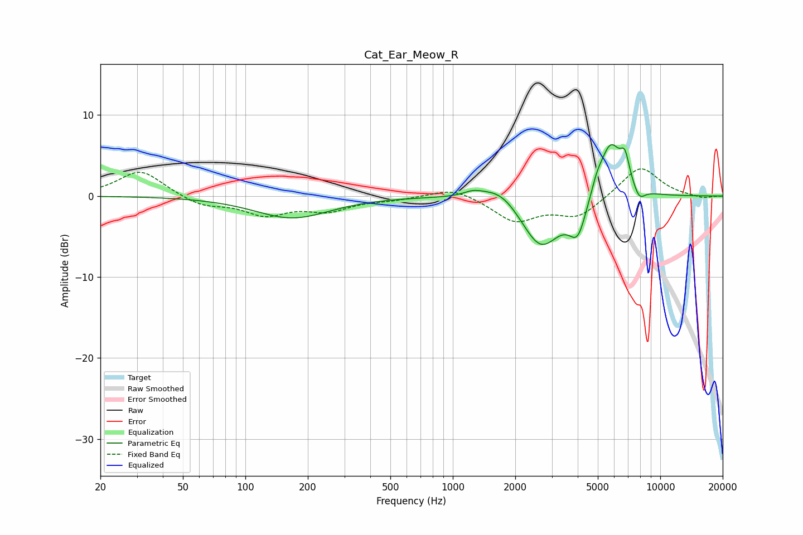

# Cat_Ear_Meow_R
See [usage instructions](https://github.com/jaakkopasanen/AutoEq#usage) for more options and info.

### Parametric EQs
Apply preamp of -6.4 dB when using parametric equalizer.

|   # | Type    |   Fc (Hz) |    Q |   Gain (dB) |
|-----|---------|-----------|------|-------------|
|   1 | Peaking |       168 | 0.78 |        -2.7 |
|   2 | Peaking |      1253 | 3.06 |         0.6 |
|   3 | Peaking |      1703 | 1.46 |         2.2 |
|   4 | Peaking |      2644 | 1.38 |        -5.8 |
|   5 | Peaking |      2672 | 1.99 |        -0.8 |
|   6 | Peaking |      4004 | 3.35 |        -4.2 |
|   7 | Peaking |      4945 | 4.72 |         1.4 |
|   8 | Peaking |      5759 | 2.53 |         6.8 |
|   9 | Peaking |      6759 | 6    |         3   |
|  10 | Peaking |      7923 | 4.89 |        -1.5 |

### Fixed Band EQs
When using fixed band (also called graphic) equalizer, apply preamp of **-3.4 dB** (if available) and set gains manually with these parameters.

|   # | Type    |   Fc (Hz) |    Q |   Gain (dB) |
|-----|---------|-----------|------|-------------|
|   1 | Peaking |        31 | 1.41 |         3.2 |
|   2 | Peaking |        62 | 1.41 |        -1.2 |
|   3 | Peaking |       125 | 1.41 |        -2.1 |
|   4 | Peaking |       250 | 1.41 |        -1.6 |
|   5 | Peaking |       500 | 1.41 |        -0.4 |
|   6 | Peaking |      1000 | 1.41 |         1.2 |
|   7 | Peaking |      2000 | 1.41 |        -3   |
|   8 | Peaking |      4000 | 1.41 |        -2.5 |
|   9 | Peaking |      8000 | 1.41 |         3.8 |
|  10 | Peaking |     16000 | 1.41 |        -0.3 |

### Graphs

