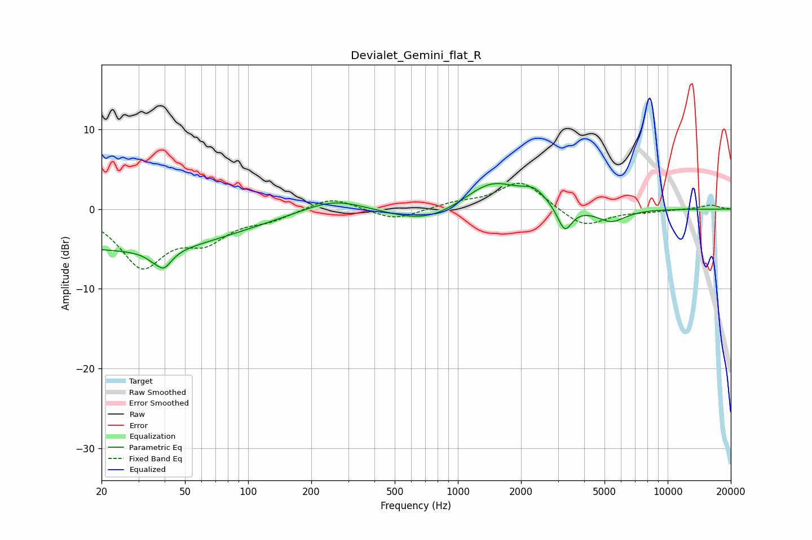

# Devialet_Gemini_flat_R
See [usage instructions](https://github.com/jaakkopasanen/AutoEq#usage) for more options and info.

### Parametric EQs
Apply preamp of -3.3 dB when using parametric equalizer.

|   # | Type    |   Fc (Hz) |    Q |   Gain (dB) |
|-----|---------|-----------|------|-------------|
|   1 | Peaking |        20 | 0.22 |        -4.6 |
|   2 | Peaking |        38 | 4.85 |         3.3 |
|   3 | Peaking |        38 | 3.88 |        -5.7 |
|   4 | Peaking |        54 | 0.48 |        -0.7 |
|   5 | Peaking |       256 | 0.98 |         1.7 |
|   6 | Peaking |       704 | 0.86 |        -1.9 |
|   7 | Peaking |      1449 | 1.1  |         3.6 |
|   8 | Peaking |      2310 | 2.35 |         1.6 |
|   9 | Peaking |      3230 | 4.07 |        -3.2 |
|  10 | Peaking |      5382 | 1.99 |        -1.7 |

### Fixed Band EQs
When using fixed band (also called graphic) equalizer, apply preamp of **-3.3 dB** (if available) and set gains manually with these parameters.

|   # | Type    |   Fc (Hz) |    Q |   Gain (dB) |
|-----|---------|-----------|------|-------------|
|   1 | Peaking |        31 | 1.41 |        -6.9 |
|   2 | Peaking |        62 | 1.41 |        -3.3 |
|   3 | Peaking |       125 | 1.41 |        -1.1 |
|   4 | Peaking |       250 | 1.41 |         1.6 |
|   5 | Peaking |       500 | 1.41 |        -1.4 |
|   6 | Peaking |      1000 | 1.41 |         0.7 |
|   7 | Peaking |      2000 | 1.41 |         3.6 |
|   8 | Peaking |      4000 | 1.41 |        -2.4 |
|   9 | Peaking |      8000 | 1.41 |        -0.2 |
|  10 | Peaking |     16000 | 1.41 |         0.5 |

### Graphs

