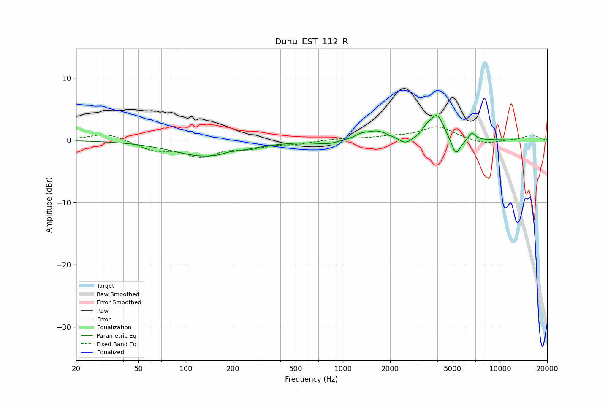

# Dunu_EST_112_R
See [usage instructions](https://github.com/jaakkopasanen/AutoEq#usage) for more options and info.

### Parametric EQs
Apply preamp of -4.1 dB when using parametric equalizer.

|   # | Type    |   Fc (Hz) |    Q |   Gain (dB) |
|-----|---------|-----------|------|-------------|
|   1 | Peaking |       136 | 0.65 |        -2.6 |
|   2 | Peaking |       190 | 3.44 |         0.3 |
|   3 | Peaking |       792 | 2.1  |        -0.6 |
|   4 | Peaking |      1305 | 3.81 |         0.5 |
|   5 | Peaking |      1643 | 1.99 |         1.4 |
|   6 | Peaking |      2501 | 3.68 |        -1   |
|   7 | Peaking |      3414 | 6    |         0.9 |
|   8 | Peaking |      3976 | 3.2  |         4.1 |
|   9 | Peaking |      5252 | 4.61 |        -2.9 |
|  10 | Peaking |      6637 | 6    |         1.2 |

### Fixed Band EQs
When using fixed band (also called graphic) equalizer, apply preamp of **-2.2 dB** (if available) and set gains manually with these parameters.

|   # | Type    |   Fc (Hz) |    Q |   Gain (dB) |
|-----|---------|-----------|------|-------------|
|   1 | Peaking |        31 | 1.41 |         1.2 |
|   2 | Peaking |        62 | 1.41 |        -1.5 |
|   3 | Peaking |       125 | 1.41 |        -2.4 |
|   4 | Peaking |       250 | 1.41 |        -1   |
|   5 | Peaking |       500 | 1.41 |        -0.5 |
|   6 | Peaking |      1000 | 1.41 |         0.3 |
|   7 | Peaking |      2000 | 1.41 |         0.4 |
|   8 | Peaking |      4000 | 1.41 |         2.2 |
|   9 | Peaking |      8000 | 1.41 |        -0.7 |
|  10 | Peaking |     16000 | 1.41 |         0.9 |

### Graphs

