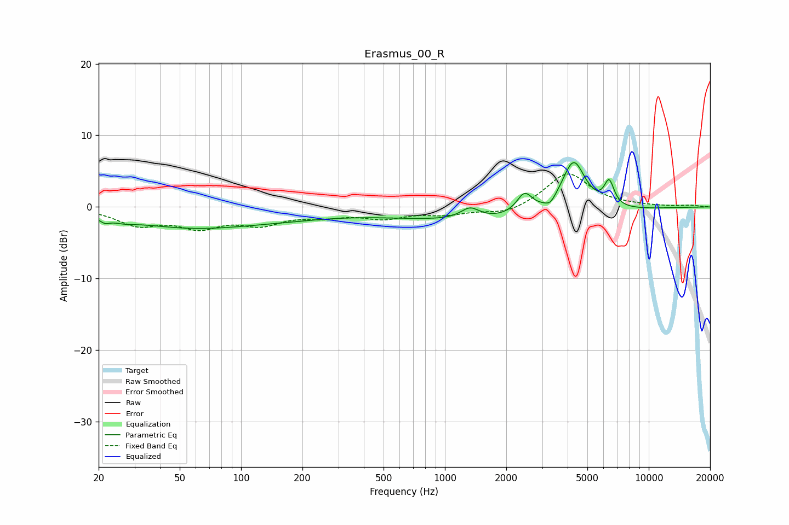

# Erasmus_00_R
See [usage instructions](https://github.com/jaakkopasanen/AutoEq#usage) for more options and info.

### Parametric EQs
Apply preamp of -6.3 dB when using parametric equalizer.

|   # | Type    |   Fc (Hz) |    Q |   Gain (dB) |
|-----|---------|-----------|------|-------------|
|   1 | Peaking |        21 | 5.98 |        -0.7 |
|   2 | Peaking |        27 | 2.43 |        -0.5 |
|   3 | Peaking |        56 | 0.43 |        -2.7 |
|   4 | Peaking |       178 | 0.59 |        -0.7 |
|   5 | Peaking |      1328 | 3.11 |         1.6 |
|   6 | Peaking |      1707 | 0.26 |        -2   |
|   7 | Peaking |      2459 | 3.62 |         2.9 |
|   8 | Peaking |      3290 | 5.57 |        -0.9 |
|   9 | Peaking |      4278 | 2.37 |         7.5 |
|  10 | Peaking |      6394 | 5.64 |         3.4 |

### Fixed Band EQs
When using fixed band (also called graphic) equalizer, apply preamp of **-4.7 dB** (if available) and set gains manually with these parameters.

|   # | Type    |   Fc (Hz) |    Q |   Gain (dB) |
|-----|---------|-----------|------|-------------|
|   1 | Peaking |        31 | 1.41 |        -2.3 |
|   2 | Peaking |        62 | 1.41 |        -2.5 |
|   3 | Peaking |       125 | 1.41 |        -2.1 |
|   4 | Peaking |       250 | 1.41 |        -1   |
|   5 | Peaking |       500 | 1.41 |        -1.4 |
|   6 | Peaking |      1000 | 1.41 |        -0.9 |
|   7 | Peaking |      2000 | 1.41 |        -1.1 |
|   8 | Peaking |      4000 | 1.41 |         4.8 |
|   9 | Peaking |      8000 | 1.41 |         0.1 |
|  10 | Peaking |     16000 | 1.41 |         0.2 |

### Graphs

