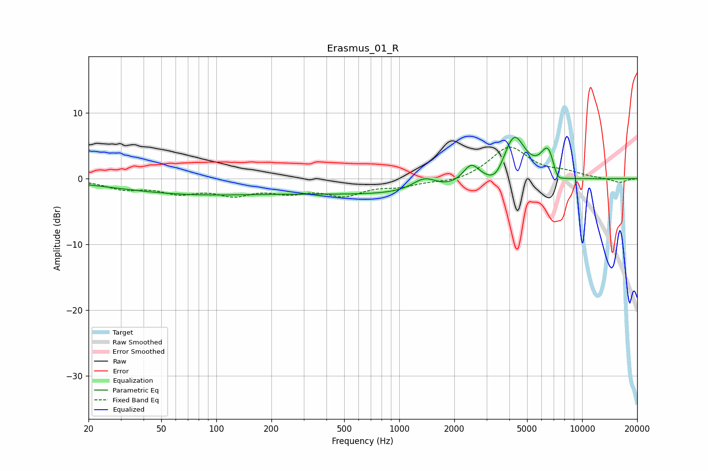

# Erasmus_01_R
See [usage instructions](https://github.com/jaakkopasanen/AutoEq#usage) for more options and info.

### Parametric EQs
Apply preamp of -6.4 dB when using parametric equalizer.

|   # | Type    |   Fc (Hz) |    Q |   Gain (dB) |
|-----|---------|-----------|------|-------------|
|   1 | Peaking |        72 | 0.34 |        -2   |
|   2 | Peaking |       106 | 0.3  |        -0.3 |
|   3 | Peaking |      1136 | 0.21 |        -2.4 |
|   4 | Peaking |      1373 | 2.13 |         2   |
|   5 | Peaking |      2474 | 2.99 |         3.1 |
|   6 | Peaking |      3381 | 3.03 |        -1.8 |
|   7 | Peaking |      4240 | 2.18 |         7.7 |
|   8 | Peaking |      6543 | 3.25 |         5.1 |
|   9 | Peaking |      7269 | 4.63 |        -2.1 |
|  10 | Peaking |      8001 | 2.45 |        -0.5 |

### Fixed Band EQs
When using fixed band (also called graphic) equalizer, apply preamp of **-4.9 dB** (if available) and set gains manually with these parameters.

|   # | Type    |   Fc (Hz) |    Q |   Gain (dB) |
|-----|---------|-----------|------|-------------|
|   1 | Peaking |        31 | 1.41 |        -1.4 |
|   2 | Peaking |        62 | 1.41 |        -1.8 |
|   3 | Peaking |       125 | 1.41 |        -2.1 |
|   4 | Peaking |       250 | 1.41 |        -1.7 |
|   5 | Peaking |       500 | 1.41 |        -2.2 |
|   6 | Peaking |      1000 | 1.41 |        -1   |
|   7 | Peaking |      2000 | 1.41 |        -0.6 |
|   8 | Peaking |      4000 | 1.41 |         4.8 |
|   9 | Peaking |      8000 | 1.41 |         0.8 |
|  10 | Peaking |     16000 | 1.41 |        -0.7 |

### Graphs

