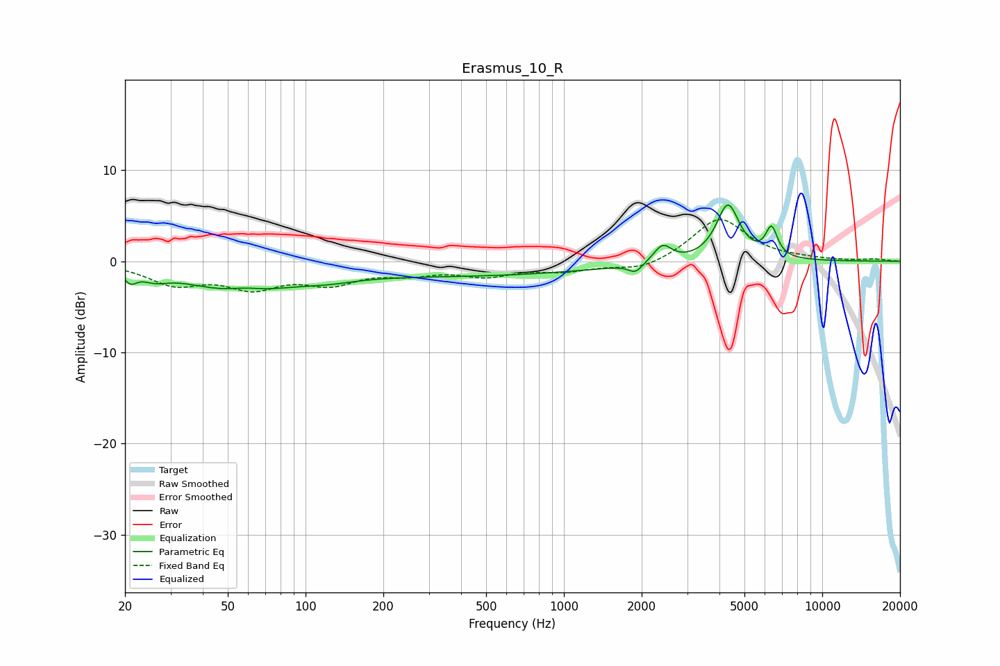

# Erasmus_10_R
See [usage instructions](https://github.com/jaakkopasanen/AutoEq#usage) for more options and info.

### Parametric EQs
Apply preamp of -6.3 dB when using parametric equalizer.

|   # | Type    |   Fc (Hz) |    Q |   Gain (dB) |
|-----|---------|-----------|------|-------------|
|   1 | Peaking |        21 | 5.98 |        -1.2 |
|   2 | Peaking |        26 | 2.78 |        -0.9 |
|   3 | Peaking |        55 | 0.69 |        -3.1 |
|   4 | Peaking |        58 | 2.14 |         0.6 |
|   5 | Peaking |       123 | 1.24 |        -0.6 |
|   6 | Peaking |       426 | 0.28 |        -1.5 |
|   7 | Peaking |      1895 | 5.26 |        -1   |
|   8 | Peaking |      2411 | 4.09 |         1.9 |
|   9 | Peaking |      4313 | 3.12 |         6.2 |
|  10 | Peaking |      6366 | 6    |         3.2 |

### Fixed Band EQs
When using fixed band (also called graphic) equalizer, apply preamp of **-4.7 dB** (if available) and set gains manually with these parameters.

|   # | Type    |   Fc (Hz) |    Q |   Gain (dB) |
|-----|---------|-----------|------|-------------|
|   1 | Peaking |        31 | 1.41 |        -2.3 |
|   2 | Peaking |        62 | 1.41 |        -2.5 |
|   3 | Peaking |       125 | 1.41 |        -2.1 |
|   4 | Peaking |       250 | 1.41 |        -1.1 |
|   5 | Peaking |       500 | 1.41 |        -1.4 |
|   6 | Peaking |      1000 | 1.41 |        -0.9 |
|   7 | Peaking |      2000 | 1.41 |        -1.1 |
|   8 | Peaking |      4000 | 1.41 |         4.8 |
|   9 | Peaking |      8000 | 1.41 |         0.1 |
|  10 | Peaking |     16000 | 1.41 |         0.2 |

### Graphs

