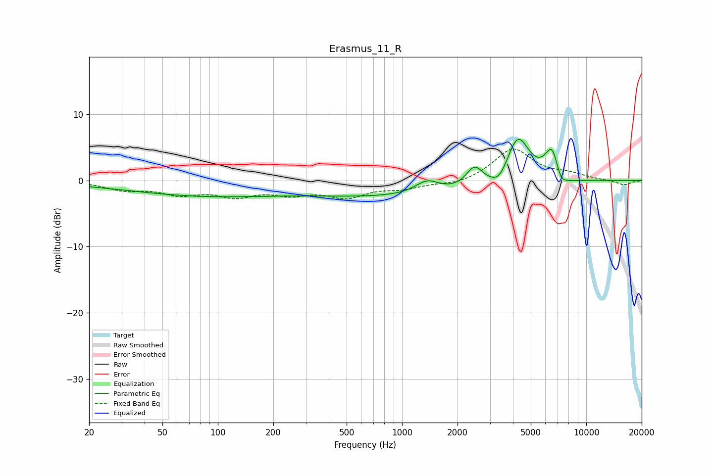

# Erasmus_11_R
See [usage instructions](https://github.com/jaakkopasanen/AutoEq#usage) for more options and info.

### Parametric EQs
Apply preamp of -6.3 dB when using parametric equalizer.

|   # | Type    |   Fc (Hz) |    Q |   Gain (dB) |
|-----|---------|-----------|------|-------------|
|   1 | Peaking |        88 | 0.38 |        -1.4 |
|   2 | Peaking |        89 | 0.18 |        -0.8 |
|   3 | Peaking |      1155 | 0.27 |        -2.3 |
|   4 | Peaking |      1369 | 2.14 |         2   |
|   5 | Peaking |      2472 | 3.16 |         3   |
|   6 | Peaking |      3372 | 3.03 |        -1.9 |
|   7 | Peaking |      4245 | 2.16 |         7.4 |
|   8 | Peaking |      6526 | 3.56 |         4.8 |
|   9 | Peaking |      7264 | 4.53 |        -2   |
|  10 | Peaking |      8210 | 2.45 |        -0.5 |

### Fixed Band EQs
When using fixed band (also called graphic) equalizer, apply preamp of **-4.8 dB** (if available) and set gains manually with these parameters.

|   # | Type    |   Fc (Hz) |    Q |   Gain (dB) |
|-----|---------|-----------|------|-------------|
|   1 | Peaking |        31 | 1.41 |        -1.3 |
|   2 | Peaking |        62 | 1.41 |        -1.8 |
|   3 | Peaking |       125 | 1.41 |        -2   |
|   4 | Peaking |       250 | 1.41 |        -1.6 |
|   5 | Peaking |       500 | 1.41 |        -2.2 |
|   6 | Peaking |      1000 | 1.41 |        -1   |
|   7 | Peaking |      2000 | 1.41 |        -0.7 |
|   8 | Peaking |      4000 | 1.41 |         4.8 |
|   9 | Peaking |      8000 | 1.41 |         0.8 |
|  10 | Peaking |     16000 | 1.41 |        -0.7 |

### Graphs

