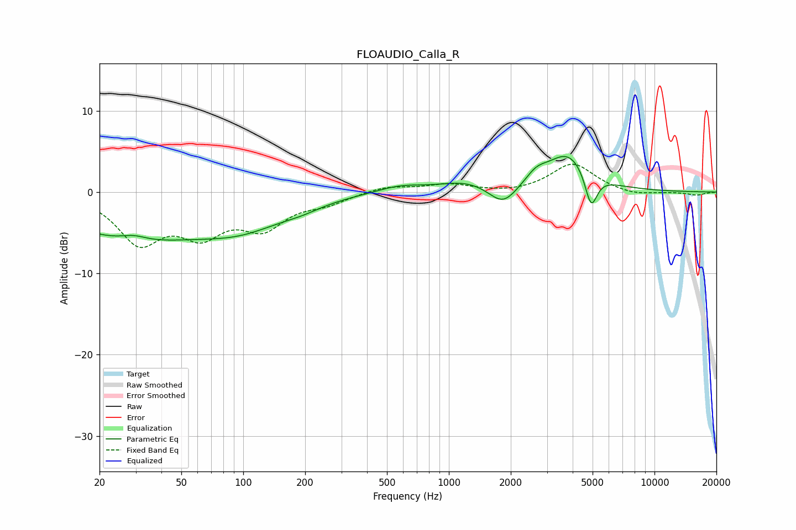

# FLOAUDIO_Calla_R
See [usage instructions](https://github.com/jaakkopasanen/AutoEq#usage) for more options and info.

### Parametric EQs
Apply preamp of -4.5 dB when using parametric equalizer.

|   # | Type    |   Fc (Hz) |    Q |   Gain (dB) |
|-----|---------|-----------|------|-------------|
|   1 | Peaking |        28 | 0.41 |        -5.4 |
|   2 | Peaking |        29 | 2.3  |         0.7 |
|   3 | Peaking |        99 | 0.64 |        -3.3 |
|   4 | Peaking |       192 | 1.41 |        -0.6 |
|   5 | Peaking |       578 | 1.25 |         0.8 |
|   6 | Peaking |      1219 | 1.08 |         1.2 |
|   7 | Peaking |      1836 | 2.02 |        -2.6 |
|   8 | Peaking |      2658 | 2.68 |         1.3 |
|   9 | Peaking |      3813 | 1.33 |         4.7 |
|  10 | Peaking |      4917 | 4.66 |        -4.4 |

### Fixed Band EQs
When using fixed band (also called graphic) equalizer, apply preamp of **-3.5 dB** (if available) and set gains manually with these parameters.

|   # | Type    |   Fc (Hz) |    Q |   Gain (dB) |
|-----|---------|-----------|------|-------------|
|   1 | Peaking |        31 | 1.41 |        -5.8 |
|   2 | Peaking |        62 | 1.41 |        -4.4 |
|   3 | Peaking |       125 | 1.41 |        -3.9 |
|   4 | Peaking |       250 | 1.41 |        -1.1 |
|   5 | Peaking |       500 | 1.41 |         0.7 |
|   6 | Peaking |      1000 | 1.41 |         0.9 |
|   7 | Peaking |      2000 | 1.41 |        -0.2 |
|   8 | Peaking |      4000 | 1.41 |         3.5 |
|   9 | Peaking |      8000 | 1.41 |        -0.5 |
|  10 | Peaking |     16000 | 1.41 |        -0.4 |

### Graphs

