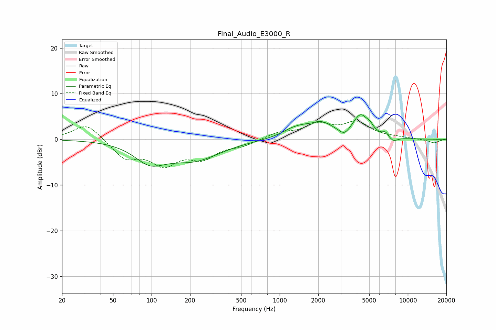

# Final_Audio_E3000_R
See [usage instructions](https://github.com/jaakkopasanen/AutoEq#usage) for more options and info.

### Parametric EQs
Apply preamp of -5.5 dB when using parametric equalizer.

|   # | Type    |   Fc (Hz) |    Q |   Gain (dB) |
|-----|---------|-----------|------|-------------|
|   1 | Peaking |        97 | 1.18 |        -4.1 |
|   2 | Peaking |       214 | 0.69 |        -4.2 |
|   3 | Peaking |      1282 | 1.5  |         1.3 |
|   4 | Peaking |      1799 | 2.96 |        -0.7 |
|   5 | Peaking |      1981 | 1.23 |         3.9 |
|   6 | Peaking |      3198 | 3.32 |        -1.6 |
|   7 | Peaking |      4279 | 2.32 |         4.8 |
|   8 | Peaking |      5078 | 5.23 |         0.9 |
|   9 | Peaking |      6690 | 5.99 |         1   |
|  10 | Peaking |      7695 | 3.86 |        -1   |

### Fixed Band EQs
When using fixed band (also called graphic) equalizer, apply preamp of **-4.1 dB** (if available) and set gains manually with these parameters.

|   # | Type    |   Fc (Hz) |    Q |   Gain (dB) |
|-----|---------|-----------|------|-------------|
|   1 | Peaking |        31 | 1.41 |         3.6 |
|   2 | Peaking |        62 | 1.41 |        -3.9 |
|   3 | Peaking |       125 | 1.41 |        -5   |
|   4 | Peaking |       250 | 1.41 |        -3.6 |
|   5 | Peaking |       500 | 1.41 |        -1.2 |
|   6 | Peaking |      1000 | 1.41 |         1.4 |
|   7 | Peaking |      2000 | 1.41 |         3   |
|   8 | Peaking |      4000 | 1.41 |         3.4 |
|   9 | Peaking |      8000 | 1.41 |         0.3 |
|  10 | Peaking |     16000 | 1.41 |        -0.8 |

### Graphs

