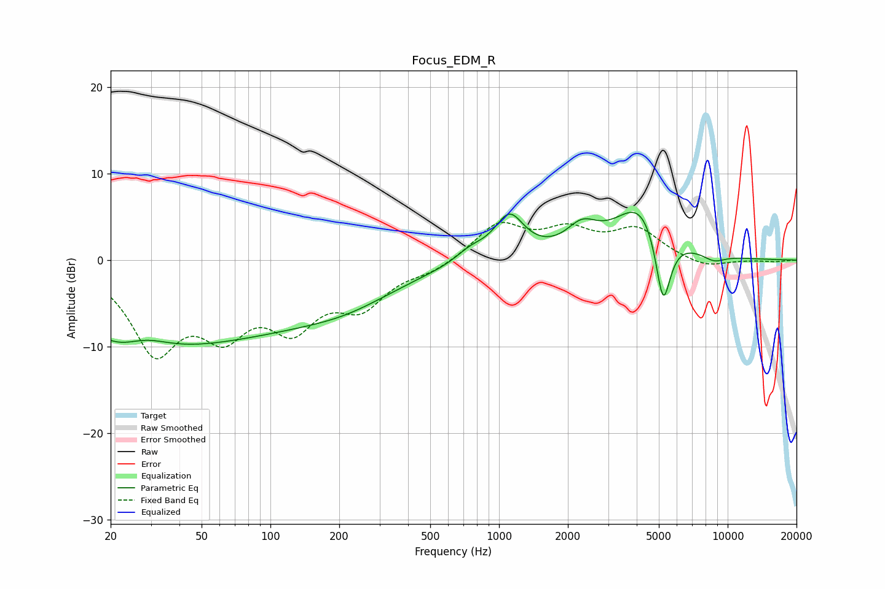

# Focus_EDM_R
See [usage instructions](https://github.com/jaakkopasanen/AutoEq#usage) for more options and info.

### Parametric EQs
Apply preamp of -5.6 dB when using parametric equalizer.

|   # | Type    |   Fc (Hz) |    Q |   Gain (dB) |
|-----|---------|-----------|------|-------------|
|   1 | Peaking |        24 | 0.67 |        -8.9 |
|   2 | Peaking |        27 | 1.12 |         4.1 |
|   3 | Peaking |        73 | 0.3  |        -7.2 |
|   4 | Peaking |       224 | 0.69 |        -1.7 |
|   5 | Peaking |       751 | 2.12 |         1.3 |
|   6 | Peaking |      1109 | 2.16 |         5   |
|   7 | Peaking |      2302 | 2.09 |         2.7 |
|   8 | Peaking |      4202 | 1.21 |         6.6 |
|   9 | Peaking |      5219 | 4.03 |        -9.1 |
|  10 | Peaking |      8694 | 2.65 |        -0.9 |

### Fixed Band EQs
When using fixed band (also called graphic) equalizer, apply preamp of **-4.5 dB** (if available) and set gains manually with these parameters.

|   # | Type    |   Fc (Hz) |    Q |   Gain (dB) |
|-----|---------|-----------|------|-------------|
|   1 | Peaking |        31 | 1.41 |        -9.8 |
|   2 | Peaking |        62 | 1.41 |        -6.7 |
|   3 | Peaking |       125 | 1.41 |        -6.5 |
|   4 | Peaking |       250 | 1.41 |        -4.6 |
|   5 | Peaking |       500 | 1.41 |        -1.1 |
|   6 | Peaking |      1000 | 1.41 |         4.1 |
|   7 | Peaking |      2000 | 1.41 |         3   |
|   8 | Peaking |      4000 | 1.41 |         3.3 |
|   9 | Peaking |      8000 | 1.41 |        -1   |
|  10 | Peaking |     16000 | 1.41 |        -0.2 |

### Graphs

