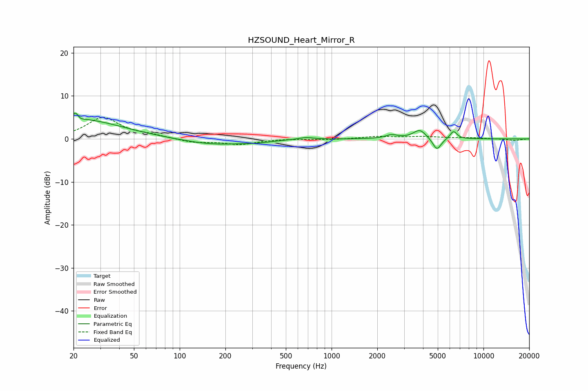

# HZSOUND_Heart_Mirror_R
See [usage instructions](https://github.com/jaakkopasanen/AutoEq#usage) for more options and info.

### Parametric EQs
Apply preamp of -6.1 dB when using parametric equalizer.

|   # | Type    |   Fc (Hz) |    Q |   Gain (dB) |
|-----|---------|-----------|------|-------------|
|   1 | Peaking |        21 | 5.97 |         3.2 |
|   2 | Peaking |        22 | 5.86 |        -2   |
|   3 | Peaking |        22 | 0.51 |         4.5 |
|   4 | Peaking |       168 | 0.69 |        -1.4 |
|   5 | Peaking |       321 | 1.55 |        -0.4 |
|   6 | Peaking |       678 | 2.86 |         0.5 |
|   7 | Peaking |      2482 | 3.51 |         0.8 |
|   8 | Peaking |      3808 | 3.32 |         2.1 |
|   9 | Peaking |      4936 | 4.93 |        -2.8 |
|  10 | Peaking |      6350 | 6    |         1.9 |

### Fixed Band EQs
When using fixed band (also called graphic) equalizer, apply preamp of **-5.1 dB** (if available) and set gains manually with these parameters.

|   # | Type    |   Fc (Hz) |    Q |   Gain (dB) |
|-----|---------|-----------|------|-------------|
|   1 | Peaking |        31 | 1.41 |         4.9 |
|   2 | Peaking |        62 | 1.41 |         0.7 |
|   3 | Peaking |       125 | 1.41 |        -0.9 |
|   4 | Peaking |       250 | 1.41 |        -1.2 |
|   5 | Peaking |       500 | 1.41 |         0   |
|   6 | Peaking |      1000 | 1.41 |        -0.2 |
|   7 | Peaking |      2000 | 1.41 |         0.5 |
|   8 | Peaking |      4000 | 1.41 |         0.5 |
|   9 | Peaking |      8000 | 1.41 |         0.2 |
|  10 | Peaking |     16000 | 1.41 |        -0.4 |

### Graphs

