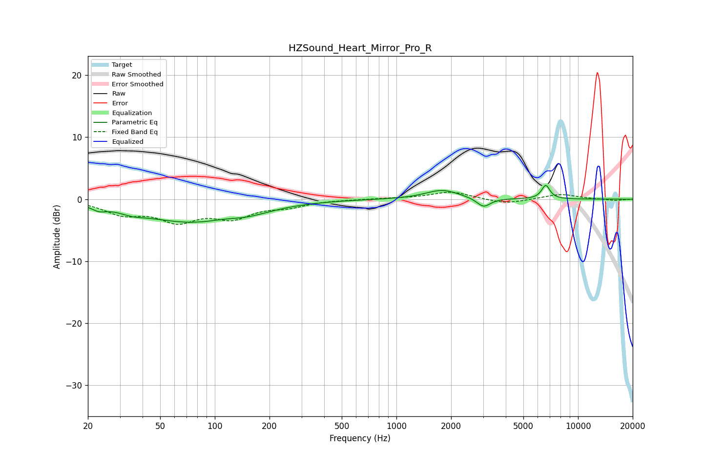

# HZSound_Heart_Mirror_Pro_R
See [usage instructions](https://github.com/jaakkopasanen/AutoEq#usage) for more options and info.

### Parametric EQs
Apply preamp of -2.3 dB when using parametric equalizer.

|   # | Type    |   Fc (Hz) |    Q |   Gain (dB) |
|-----|---------|-----------|------|-------------|
|   1 | Peaking |        23 | 3.84 |        -0.7 |
|   2 | Peaking |        35 | 2.12 |        -0.6 |
|   3 | Peaking |        75 | 0.49 |        -3.6 |
|   4 | Peaking |       117 | 1.42 |         0.4 |
|   5 | Peaking |       118 | 1.29 |         0.3 |
|   6 | Peaking |       143 | 1.15 |        -0.7 |
|   7 | Peaking |       145 | 0.99 |        -0.2 |
|   8 | Peaking |      1788 | 1.53 |         1.5 |
|   9 | Peaking |      3021 | 3.79 |        -1.5 |
|  10 | Peaking |      6641 | 6    |         2.2 |

### Fixed Band EQs
When using fixed band (also called graphic) equalizer, apply preamp of **-1.2 dB** (if available) and set gains manually with these parameters.

|   # | Type    |   Fc (Hz) |    Q |   Gain (dB) |
|-----|---------|-----------|------|-------------|
|   1 | Peaking |        31 | 1.41 |        -2.1 |
|   2 | Peaking |        62 | 1.41 |        -3.2 |
|   3 | Peaking |       125 | 1.41 |        -2.6 |
|   4 | Peaking |       250 | 1.41 |        -1   |
|   5 | Peaking |       500 | 1.41 |        -0   |
|   6 | Peaking |      1000 | 1.41 |         0.1 |
|   7 | Peaking |      2000 | 1.41 |         1.2 |
|   8 | Peaking |      4000 | 1.41 |        -0.8 |
|   9 | Peaking |      8000 | 1.41 |         0.8 |
|  10 | Peaking |     16000 | 1.41 |        -0.2 |

### Graphs

