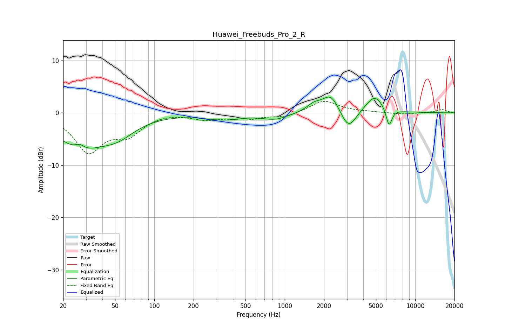

# Huawei_Freebuds_Pro_2_R
See [usage instructions](https://github.com/jaakkopasanen/AutoEq#usage) for more options and info.

### Parametric EQs
Apply preamp of -3.1 dB when using parametric equalizer.

|   # | Type    |   Fc (Hz) |    Q |   Gain (dB) |
|-----|---------|-----------|------|-------------|
|   1 | Peaking |        27 | 0.82 |        -6.2 |
|   2 | Peaking |        27 | 3.91 |         1.1 |
|   3 | Peaking |        52 | 1.02 |        -3.1 |
|   4 | Peaking |       336 | 0.97 |        -1.2 |
|   5 | Peaking |       847 | 1.43 |        -1.2 |
|   6 | Peaking |      1679 | 2.42 |         1.4 |
|   7 | Peaking |      2261 | 2.27 |         3.5 |
|   8 | Peaking |      3077 | 2.41 |        -3.8 |
|   9 | Peaking |      4897 | 1.99 |         3.4 |
|  10 | Peaking |      6292 | 5.99 |        -3.6 |

### Fixed Band EQs
When using fixed band (also called graphic) equalizer, apply preamp of **-2.3 dB** (if available) and set gains manually with these parameters.

|   # | Type    |   Fc (Hz) |    Q |   Gain (dB) |
|-----|---------|-----------|------|-------------|
|   1 | Peaking |        31 | 1.41 |        -7.2 |
|   2 | Peaking |        62 | 1.41 |        -3.7 |
|   3 | Peaking |       125 | 1.41 |         0.2 |
|   4 | Peaking |       250 | 1.41 |        -1.1 |
|   5 | Peaking |       500 | 1.41 |        -1.1 |
|   6 | Peaking |      1000 | 1.41 |        -0.8 |
|   7 | Peaking |      2000 | 1.41 |         2.4 |
|   8 | Peaking |      4000 | 1.41 |         0.1 |
|   9 | Peaking |      8000 | 1.41 |        -0.3 |
|  10 | Peaking |     16000 | 1.41 |         0.6 |

### Graphs

