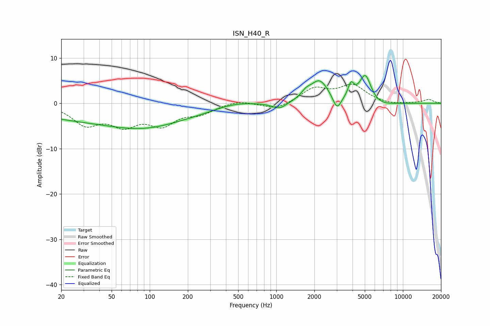

# ISN_H40_R
See [usage instructions](https://github.com/jaakkopasanen/AutoEq#usage) for more options and info.

### Parametric EQs
Apply preamp of -6.2 dB when using parametric equalizer.

|   # | Type    |   Fc (Hz) |    Q |   Gain (dB) |
|-----|---------|-----------|------|-------------|
|   1 | Peaking |        56 | 0.19 |        -4   |
|   2 | Peaking |        88 | 0.59 |        -1.7 |
|   3 | Peaking |       464 | 0.89 |         1   |
|   4 | Peaking |      1059 | 2.48 |        -1.5 |
|   5 | Peaking |      1714 | 3.73 |         1.2 |
|   6 | Peaking |      2194 | 1.93 |         4.9 |
|   7 | Peaking |      3015 | 4.27 |        -3.1 |
|   8 | Peaking |      3889 | 5.96 |         3   |
|   9 | Peaking |      5048 | 2.85 |         6.6 |
|  10 | Peaking |      6145 | 1.32 |        -1.2 |

### Fixed Band EQs
When using fixed band (also called graphic) equalizer, apply preamp of **-4.3 dB** (if available) and set gains manually with these parameters.

|   # | Type    |   Fc (Hz) |    Q |   Gain (dB) |
|-----|---------|-----------|------|-------------|
|   1 | Peaking |        31 | 1.41 |        -4.3 |
|   2 | Peaking |        62 | 1.41 |        -4.1 |
|   3 | Peaking |       125 | 1.41 |        -4.2 |
|   4 | Peaking |       250 | 1.41 |        -1.9 |
|   5 | Peaking |       500 | 1.41 |         0.8 |
|   6 | Peaking |      1000 | 1.41 |        -1.5 |
|   7 | Peaking |      2000 | 1.41 |         3.1 |
|   8 | Peaking |      4000 | 1.41 |         3.7 |
|   9 | Peaking |      8000 | 1.41 |        -0.4 |
|  10 | Peaking |     16000 | 1.41 |         0.8 |

### Graphs

