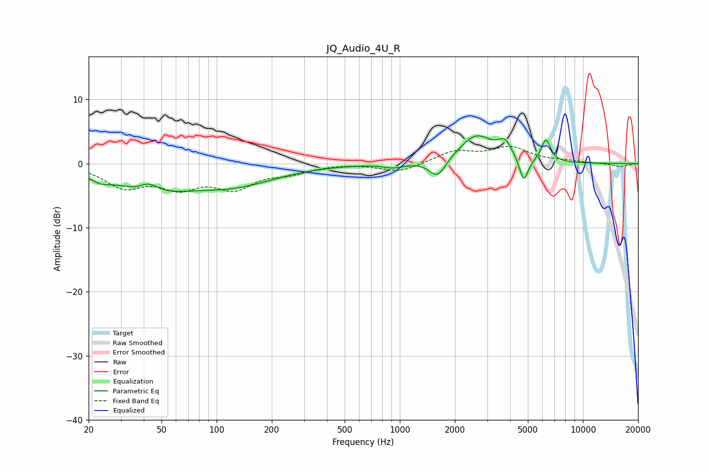

# JQ_Audio_4U_R
See [usage instructions](https://github.com/jaakkopasanen/AutoEq#usage) for more options and info.

### Parametric EQs
Apply preamp of -4.4 dB when using parametric equalizer.

|   # | Type    |   Fc (Hz) |    Q |   Gain (dB) |
|-----|---------|-----------|------|-------------|
|   1 | Peaking |        23 | 3.59 |        -0.7 |
|   2 | Peaking |        43 | 3.11 |         1.3 |
|   3 | Peaking |        43 | 0.59 |        -3.8 |
|   4 | Peaking |       129 | 0.63 |        -2.7 |
|   5 | Peaking |       923 | 2.67 |        -0.6 |
|   6 | Peaking |      1607 | 3.19 |        -2.8 |
|   7 | Peaking |      2612 | 1.53 |         4.4 |
|   8 | Peaking |      3752 | 3.75 |         2.3 |
|   9 | Peaking |      4755 | 5.78 |        -3.9 |
|  10 | Peaking |      6275 | 5.5  |         3.5 |

### Fixed Band EQs
When using fixed band (also called graphic) equalizer, apply preamp of **-2.8 dB** (if available) and set gains manually with these parameters.

|   # | Type    |   Fc (Hz) |    Q |   Gain (dB) |
|-----|---------|-----------|------|-------------|
|   1 | Peaking |        31 | 1.41 |        -3.4 |
|   2 | Peaking |        62 | 1.41 |        -3.2 |
|   3 | Peaking |       125 | 1.41 |        -3.4 |
|   4 | Peaking |       250 | 1.41 |        -1.2 |
|   5 | Peaking |       500 | 1.41 |         0.1 |
|   6 | Peaking |      1000 | 1.41 |        -1.4 |
|   7 | Peaking |      2000 | 1.41 |         1.8 |
|   8 | Peaking |      4000 | 1.41 |         2.4 |
|   9 | Peaking |      8000 | 1.41 |         0.3 |
|  10 | Peaking |     16000 | 1.41 |        -0.5 |

### Graphs

