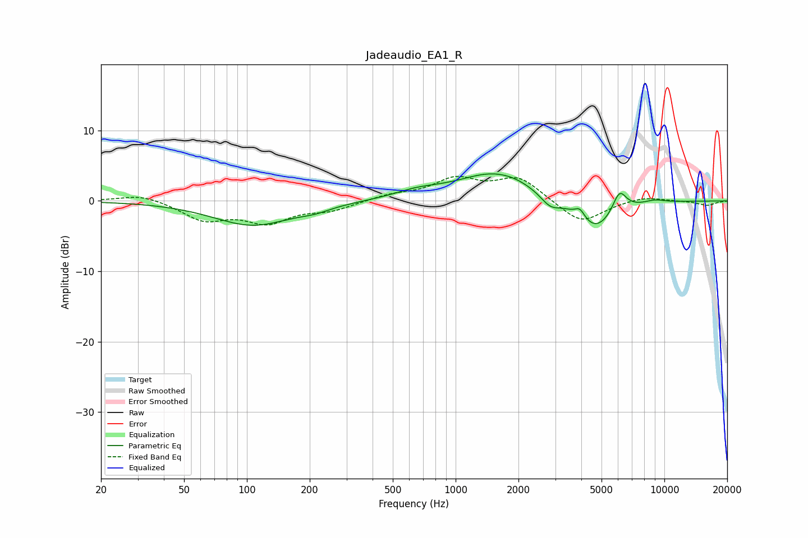

# Jadeaudio_EA1_R
See [usage instructions](https://github.com/jaakkopasanen/AutoEq#usage) for more options and info.

### Parametric EQs
Apply preamp of -3.9 dB when using parametric equalizer.

|   # | Type    |   Fc (Hz) |    Q |   Gain (dB) |
|-----|---------|-----------|------|-------------|
|   1 | Peaking |       107 | 0.75 |        -3.4 |
|   2 | Peaking |       212 | 1.98 |        -0.6 |
|   3 | Peaking |       657 | 1.21 |         1   |
|   4 | Peaking |      1523 | 0.8  |         3.8 |
|   5 | Peaking |      1953 | 1.62 |         0.3 |
|   6 | Peaking |      2840 | 3.03 |        -1.6 |
|   7 | Peaking |      3939 | 6    |         1.3 |
|   8 | Peaking |      4683 | 1.49 |        -4.4 |
|   9 | Peaking |      6095 | 4.12 |         3.1 |
|  10 | Peaking |      8999 | 2.71 |         0.4 |

### Fixed Band EQs
When using fixed band (also called graphic) equalizer, apply preamp of **-3.6 dB** (if available) and set gains manually with these parameters.

|   # | Type    |   Fc (Hz) |    Q |   Gain (dB) |
|-----|---------|-----------|------|-------------|
|   1 | Peaking |        31 | 1.41 |         1   |
|   2 | Peaking |        62 | 1.41 |        -2.6 |
|   3 | Peaking |       125 | 1.41 |        -2.8 |
|   4 | Peaking |       250 | 1.41 |        -1.2 |
|   5 | Peaking |       500 | 1.41 |         0.8 |
|   6 | Peaking |      1000 | 1.41 |         2.9 |
|   7 | Peaking |      2000 | 1.41 |         3.2 |
|   8 | Peaking |      4000 | 1.41 |        -3.3 |
|   9 | Peaking |      8000 | 1.41 |         0.7 |
|  10 | Peaking |     16000 | 1.41 |        -0.6 |

### Graphs

