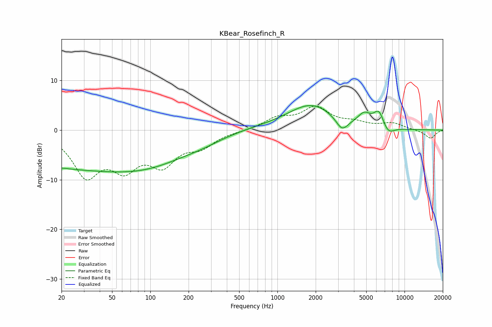

# KBear_Rosefinch_R
See [usage instructions](https://github.com/jaakkopasanen/AutoEq#usage) for more options and info.

### Parametric EQs
Apply preamp of -5.0 dB when using parametric equalizer.

|   # | Type    |   Fc (Hz) |    Q |   Gain (dB) |
|-----|---------|-----------|------|-------------|
|   1 | Peaking |        20 | 0.21 |        -6.8 |
|   2 | Peaking |        24 | 0.72 |        -0.2 |
|   3 | Peaking |       108 | 0.44 |        -4.2 |
|   4 | Peaking |       264 | 0.82 |        -1   |
|   5 | Peaking |       532 | 0.47 |         0.5 |
|   6 | Peaking |      1848 | 0.76 |         5   |
|   7 | Peaking |      3223 | 2.91 |        -2.7 |
|   8 | Peaking |      4819 | 2.81 |         2.2 |
|   9 | Peaking |      6283 | 3.37 |         3.3 |
|  10 | Peaking |      7414 | 2.87 |        -1.8 |

### Fixed Band EQs
When using fixed band (also called graphic) equalizer, apply preamp of **-4.9 dB** (if available) and set gains manually with these parameters.

|   # | Type    |   Fc (Hz) |    Q |   Gain (dB) |
|-----|---------|-----------|------|-------------|
|   1 | Peaking |        31 | 1.41 |        -8.6 |
|   2 | Peaking |        62 | 1.41 |        -6.3 |
|   3 | Peaking |       125 | 1.41 |        -6   |
|   4 | Peaking |       250 | 1.41 |        -2.8 |
|   5 | Peaking |       500 | 1.41 |        -0.1 |
|   6 | Peaking |      1000 | 1.41 |         2.2 |
|   7 | Peaking |      2000 | 1.41 |         4.3 |
|   8 | Peaking |      4000 | 1.41 |         1.2 |
|   9 | Peaking |      8000 | 1.41 |         1.3 |
|  10 | Peaking |     16000 | 1.41 |        -1.7 |

### Graphs

