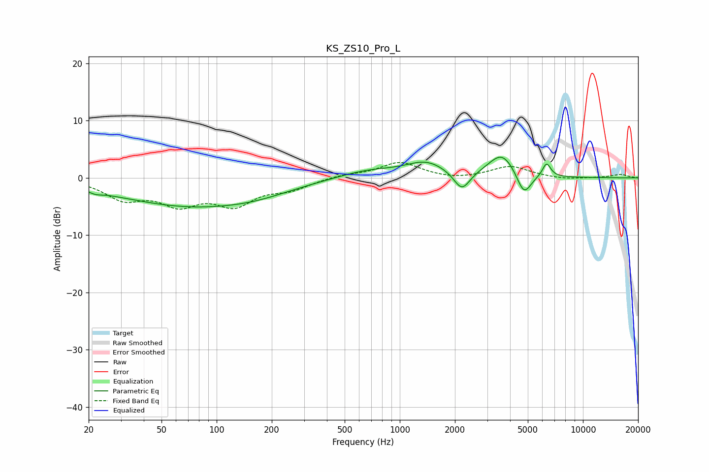

# KS_ZS10_Pro_L
See [usage instructions](https://github.com/jaakkopasanen/AutoEq#usage) for more options and info.

### Parametric EQs
Apply preamp of -3.7 dB when using parametric equalizer.

|   # | Type    |   Fc (Hz) |    Q |   Gain (dB) |
|-----|---------|-----------|------|-------------|
|   1 | Peaking |        22 | 4.1  |        -0.5 |
|   2 | Peaking |        25 | 0.8  |        -0.4 |
|   3 | Peaking |        70 | 0.39 |        -4.6 |
|   4 | Peaking |       166 | 0.7  |        -1.2 |
|   5 | Peaking |       673 | 0.86 |         1.3 |
|   6 | Peaking |      1392 | 1.29 |         2.5 |
|   7 | Peaking |      2183 | 3.2  |        -3.4 |
|   8 | Peaking |      3621 | 1.9  |         4.3 |
|   9 | Peaking |      4761 | 3.48 |        -4.2 |
|  10 | Peaking |      6328 | 6    |         2.4 |

### Fixed Band EQs
When using fixed band (also called graphic) equalizer, apply preamp of **-2.8 dB** (if available) and set gains manually with these parameters.

|   # | Type    |   Fc (Hz) |    Q |   Gain (dB) |
|-----|---------|-----------|------|-------------|
|   1 | Peaking |        31 | 1.41 |        -3.3 |
|   2 | Peaking |        62 | 1.41 |        -4   |
|   3 | Peaking |       125 | 1.41 |        -4.2 |
|   4 | Peaking |       250 | 1.41 |        -1.7 |
|   5 | Peaking |       500 | 1.41 |         0.5 |
|   6 | Peaking |      1000 | 1.41 |         2.7 |
|   7 | Peaking |      2000 | 1.41 |        -0.4 |
|   8 | Peaking |      4000 | 1.41 |         2   |
|   9 | Peaking |      8000 | 1.41 |        -0.3 |
|  10 | Peaking |     16000 | 1.41 |         0.6 |

### Graphs

