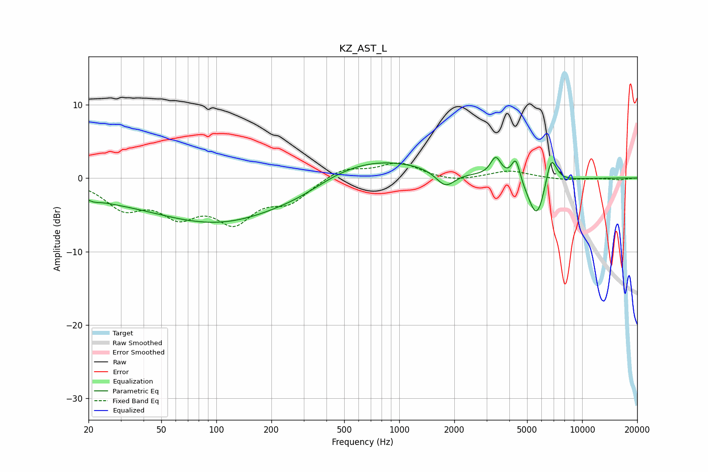

# KZ_AST_L
See [usage instructions](https://github.com/jaakkopasanen/AutoEq#usage) for more options and info.

### Parametric EQs
Apply preamp of -2.9 dB when using parametric equalizer.

|   # | Type    |   Fc (Hz) |    Q |   Gain (dB) |
|-----|---------|-----------|------|-------------|
|   1 | Peaking |        20 | 0.56 |        -1.4 |
|   2 | Peaking |        21 | 5.57 |        -0.2 |
|   3 | Peaking |       112 | 0.34 |        -6.3 |
|   4 | Peaking |       296 | 0.89 |        -1.1 |
|   5 | Peaking |       580 | 0.4  |         3.6 |
|   6 | Peaking |      1789 | 2.68 |        -2.3 |
|   7 | Peaking |      3372 | 4.87 |         2.6 |
|   8 | Peaking |      4342 | 6    |         3.1 |
|   9 | Peaking |      5662 | 2.79 |        -6   |
|  10 | Peaking |      6753 | 4.36 |         4.4 |

### Fixed Band EQs
When using fixed band (also called graphic) equalizer, apply preamp of **-2.2 dB** (if available) and set gains manually with these parameters.

|   # | Type    |   Fc (Hz) |    Q |   Gain (dB) |
|-----|---------|-----------|------|-------------|
|   1 | Peaking |        31 | 1.41 |        -3.7 |
|   2 | Peaking |        62 | 1.41 |        -4.2 |
|   3 | Peaking |       125 | 1.41 |        -5.2 |
|   4 | Peaking |       250 | 1.41 |        -2.8 |
|   5 | Peaking |       500 | 1.41 |         1.5 |
|   6 | Peaking |      1000 | 1.41 |         2   |
|   7 | Peaking |      2000 | 1.41 |        -0.6 |
|   8 | Peaking |      4000 | 1.41 |         1   |
|   9 | Peaking |      8000 | 1.41 |        -0.3 |
|  10 | Peaking |     16000 | 1.41 |        -0.2 |

### Graphs

