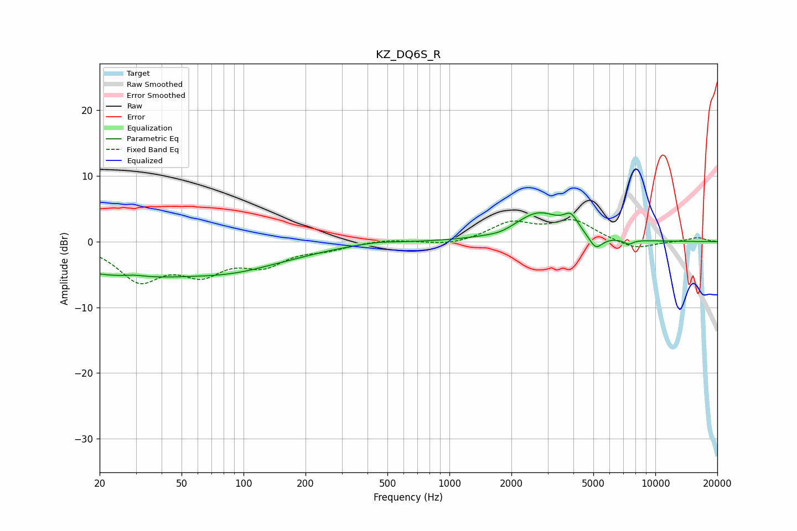

# KZ_DQ6S_R
See [usage instructions](https://github.com/jaakkopasanen/AutoEq#usage) for more options and info.

### Parametric EQs
Apply preamp of -4.5 dB when using parametric equalizer.

|   # | Type    |   Fc (Hz) |    Q |   Gain (dB) |
|-----|---------|-----------|------|-------------|
|   1 | Peaking |        25 | 0.4  |        -4.7 |
|   2 | Peaking |        29 | 2.66 |         0.4 |
|   3 | Peaking |        94 | 0.56 |        -3.1 |
|   4 | Peaking |       197 | 1.3  |        -0.2 |
|   5 | Peaking |       448 | 1.71 |         0.3 |
|   6 | Peaking |      1775 | 2.4  |        -0.4 |
|   7 | Peaking |      2710 | 1.22 |         4.3 |
|   8 | Peaking |      3895 | 4.05 |         2.3 |
|   9 | Peaking |      5135 | 4.37 |        -2.1 |
|  10 | Peaking |      7422 | 6    |        -0.7 |

### Fixed Band EQs
When using fixed band (also called graphic) equalizer, apply preamp of **-3.4 dB** (if available) and set gains manually with these parameters.

|   # | Type    |   Fc (Hz) |    Q |   Gain (dB) |
|-----|---------|-----------|------|-------------|
|   1 | Peaking |        31 | 1.41 |        -5.5 |
|   2 | Peaking |        62 | 1.41 |        -4.1 |
|   3 | Peaking |       125 | 1.41 |        -3.1 |
|   4 | Peaking |       250 | 1.41 |        -0.9 |
|   5 | Peaking |       500 | 1.41 |         0.4 |
|   6 | Peaking |      1000 | 1.41 |        -0.6 |
|   7 | Peaking |      2000 | 1.41 |         2.7 |
|   8 | Peaking |      4000 | 1.41 |         3   |
|   9 | Peaking |      8000 | 1.41 |        -1.3 |
|  10 | Peaking |     16000 | 1.41 |         0.6 |

### Graphs

