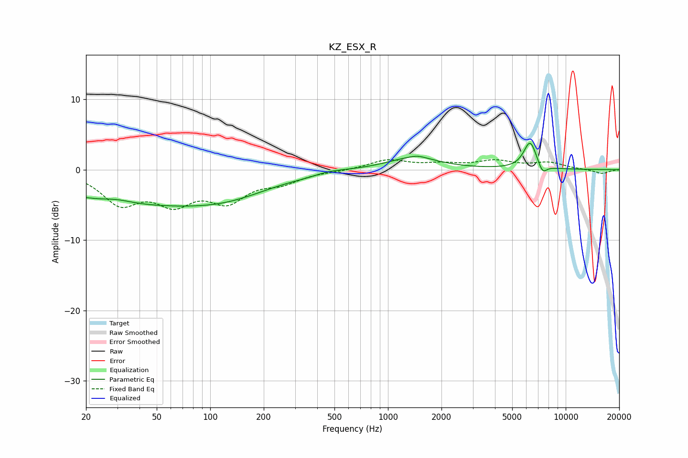

# KZ_ESX_R
See [usage instructions](https://github.com/jaakkopasanen/AutoEq#usage) for more options and info.

### Parametric EQs
Apply preamp of -3.8 dB when using parametric equalizer.

|   # | Type    |   Fc (Hz) |    Q |   Gain (dB) |
|-----|---------|-----------|------|-------------|
|   1 | Peaking |        30 | 1.72 |         0.5 |
|   2 | Peaking |        38 | 0.27 |        -4.6 |
|   3 | Peaking |       130 | 0.59 |        -1.8 |
|   4 | Peaking |       371 | 1.48 |        -0.3 |
|   5 | Peaking |       446 | 1.42 |         0.5 |
|   6 | Peaking |      1387 | 0.96 |         1.7 |
|   7 | Peaking |      1471 | 3.41 |         0.3 |
|   8 | Peaking |      5399 | 6    |        -0   |
|   9 | Peaking |      6305 | 3.75 |         3.9 |
|  10 | Peaking |      7407 | 5.5  |        -1.4 |

### Fixed Band EQs
When using fixed band (also called graphic) equalizer, apply preamp of **-1.5 dB** (if available) and set gains manually with these parameters.

|   # | Type    |   Fc (Hz) |    Q |   Gain (dB) |
|-----|---------|-----------|------|-------------|
|   1 | Peaking |        31 | 1.41 |        -4.4 |
|   2 | Peaking |        62 | 1.41 |        -4.1 |
|   3 | Peaking |       125 | 1.41 |        -3.9 |
|   4 | Peaking |       250 | 1.41 |        -1.5 |
|   5 | Peaking |       500 | 1.41 |        -0.1 |
|   6 | Peaking |      1000 | 1.41 |         1.4 |
|   7 | Peaking |      2000 | 1.41 |         0.6 |
|   8 | Peaking |      4000 | 1.41 |         1.1 |
|   9 | Peaking |      8000 | 1.41 |         0.9 |
|  10 | Peaking |     16000 | 1.41 |        -0.6 |

### Graphs

