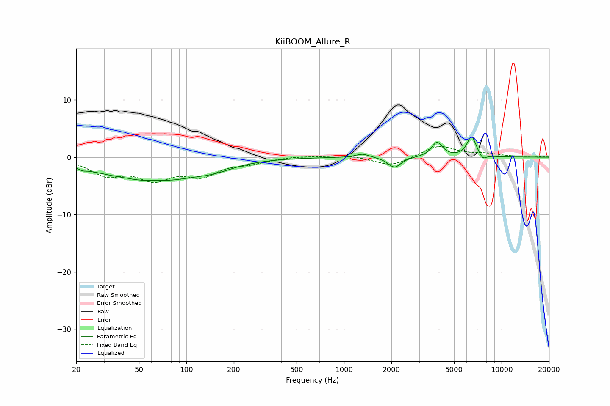

# KiiBOOM_Allure_R
See [usage instructions](https://github.com/jaakkopasanen/AutoEq#usage) for more options and info.

### Parametric EQs
Apply preamp of -3.6 dB when using parametric equalizer.

|   # | Type    |   Fc (Hz) |    Q |   Gain (dB) |
|-----|---------|-----------|------|-------------|
|   1 | Peaking |        22 | 4.69 |        -0.5 |
|   2 | Peaking |        28 | 1.11 |        -0.9 |
|   3 | Peaking |        63 | 0.62 |        -4.2 |
|   4 | Peaking |        65 | 1.58 |         0.5 |
|   5 | Peaking |       149 | 1.04 |        -1.2 |
|   6 | Peaking |      1314 | 3.34 |         0.7 |
|   7 | Peaking |      2091 | 3.56 |        -1.9 |
|   8 | Peaking |      3895 | 4.23 |         2.6 |
|   9 | Peaking |      6458 | 4.71 |         3.6 |
|  10 | Peaking |      7606 | 5.92 |        -0.9 |

### Fixed Band EQs
When using fixed band (also called graphic) equalizer, apply preamp of **-2.0 dB** (if available) and set gains manually with these parameters.

|   # | Type    |   Fc (Hz) |    Q |   Gain (dB) |
|-----|---------|-----------|------|-------------|
|   1 | Peaking |        31 | 1.41 |        -2.8 |
|   2 | Peaking |        62 | 1.41 |        -3.4 |
|   3 | Peaking |       125 | 1.41 |        -2.8 |
|   4 | Peaking |       250 | 1.41 |        -0.8 |
|   5 | Peaking |       500 | 1.41 |         0.2 |
|   6 | Peaking |      1000 | 1.41 |         0.4 |
|   7 | Peaking |      2000 | 1.41 |        -1.6 |
|   8 | Peaking |      4000 | 1.41 |         2   |
|   9 | Peaking |      8000 | 1.41 |         0.5 |
|  10 | Peaking |     16000 | 1.41 |         0.1 |

### Graphs

