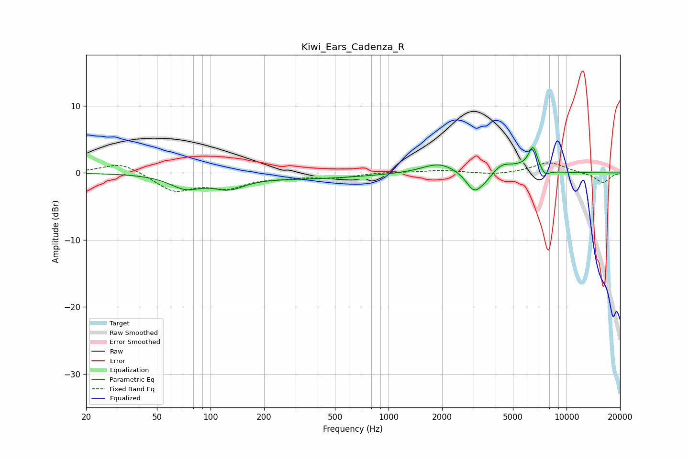

# Kiwi_Ears_Cadenza_R
See [usage instructions](https://github.com/jaakkopasanen/AutoEq#usage) for more options and info.

### Parametric EQs
Apply preamp of -3.9 dB when using parametric equalizer.

|   # | Type    |   Fc (Hz) |    Q |   Gain (dB) |
|-----|---------|-----------|------|-------------|
|   1 | Peaking |        72 | 1.59 |        -1.9 |
|   2 | Peaking |       127 | 1.6  |        -1.8 |
|   3 | Peaking |       347 | 0.42 |        -0.8 |
|   4 | Peaking |      1928 | 1.49 |         1.6 |
|   5 | Peaking |      3015 | 3.21 |        -2.7 |
|   6 | Peaking |      3471 | 2.67 |        -1.1 |
|   7 | Peaking |      4336 | 2.49 |         1.4 |
|   8 | Peaking |      5558 | 2.12 |         0.6 |
|   9 | Peaking |      6486 | 5.28 |         3.5 |
|  10 | Peaking |      7549 | 5.04 |        -1   |

### Fixed Band EQs
When using fixed band (also called graphic) equalizer, apply preamp of **-1.6 dB** (if available) and set gains manually with these parameters.

|   # | Type    |   Fc (Hz) |    Q |   Gain (dB) |
|-----|---------|-----------|------|-------------|
|   1 | Peaking |        31 | 1.41 |         1.6 |
|   2 | Peaking |        62 | 1.41 |        -2.6 |
|   3 | Peaking |       125 | 1.41 |        -1.9 |
|   4 | Peaking |       250 | 1.41 |        -0.5 |
|   5 | Peaking |       500 | 1.41 |        -0.7 |
|   6 | Peaking |      1000 | 1.41 |         0.1 |
|   7 | Peaking |      2000 | 1.41 |         0.4 |
|   8 | Peaking |      4000 | 1.41 |        -0.3 |
|   9 | Peaking |      8000 | 1.41 |         1.6 |
|  10 | Peaking |     16000 | 1.41 |        -1.5 |

### Graphs

